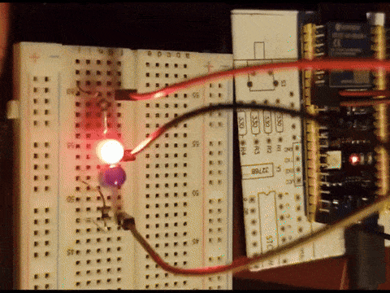
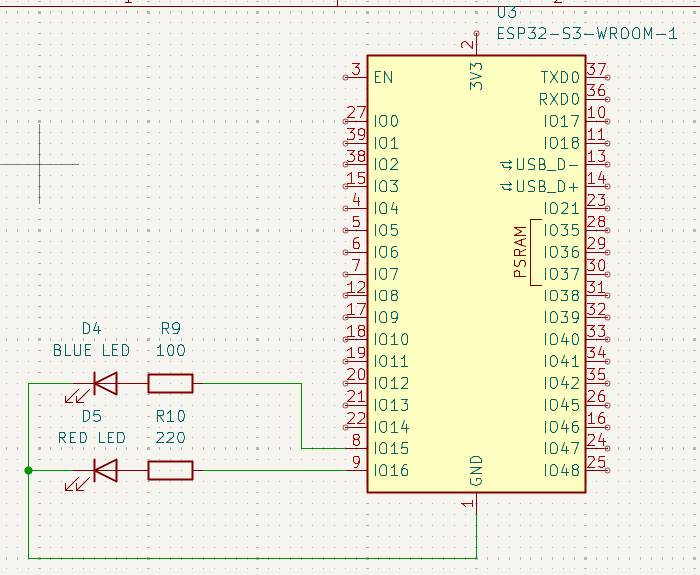
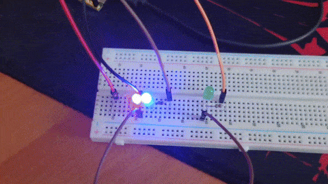
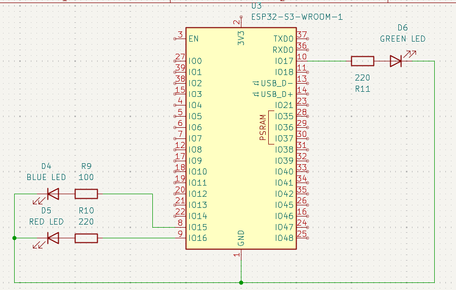
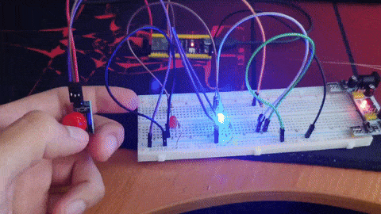
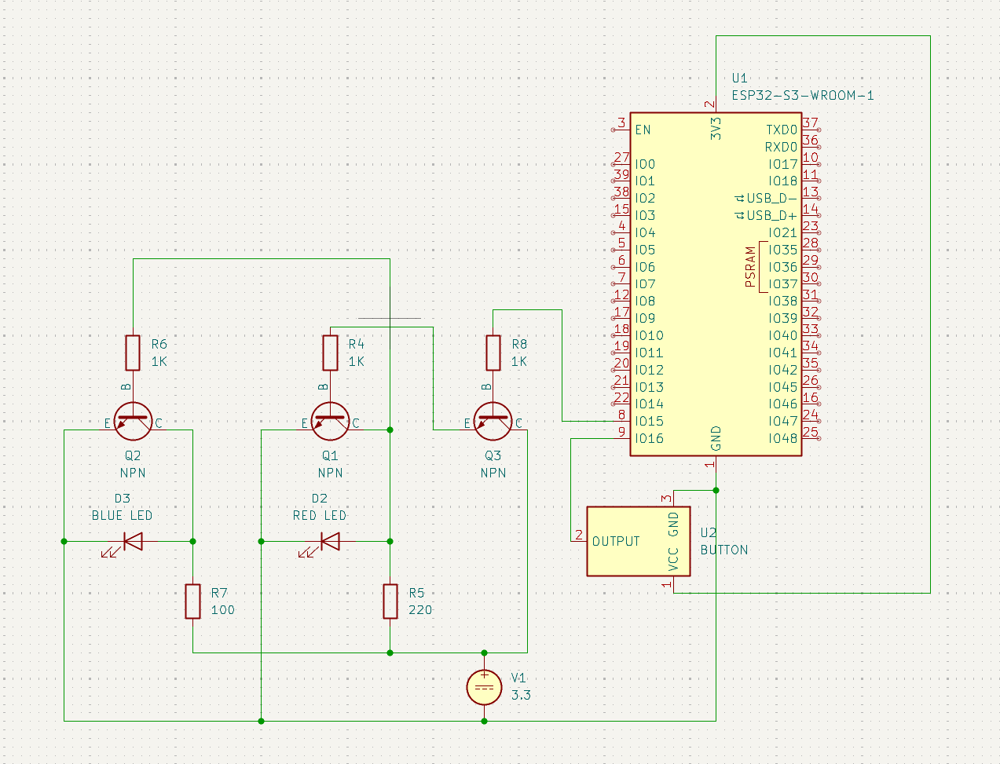

# ДЗ Модуль 1.3; Анищенко М.О.

# Базове завдання

### Вимоги
Створити програму для ESP32, яка керує двома світлодіодами (червоний і синій) та імітує роботу поліцейської мигалки.
* Використати два GPIO-виводи ESP32.
* Під’єднати червоний та синій світлодіоди через резистори.
* Реалізувати послідовність миготіння, у якій червоний і синій LED блимають по черзі.
* Програма має працювати циклічно.

### Вирішення


**Проект:** [basic-police-lights](basic-police-lights) \
Код вмикає та вимикає червоний і синій світлодіоди у заданій послідовності, створюючи ефект миготіння.

#### Код
```c
#include <Arduino.h>


#define RED_LED_OUT 15  // Пін до якого підключено червоний світлодіод
#define BLUE_LED_OUT 16 // Пін до якого підключено синій світлодіод

void setup() {
    // Налаштовуємо піни як вихіди (OUTPUT), щоб контролер міг подавати на них напругу
    pinMode(RED_LED_OUT, OUTPUT);
    pinMode(BLUE_LED_OUT, OUTPUT);
}

void loop() {
    digitalWrite(BLUE_LED_OUT, LOW);  // Вимикаємо синій світлодіод
    digitalWrite(RED_LED_OUT, HIGH);  // Вмикаємо червоний світлодіод
    delay(500);                       // Чекаємо 500 мілісекунд

    digitalWrite(RED_LED_OUT, LOW);   // Вимикаємо червоний світлодіод
    digitalWrite(BLUE_LED_OUT, HIGH); // Вмикаємо синій світлодіод
    delay(500);                       // Чекаємо 500 мілісекунд
}
```

#### Схема



# Додаткові завдання

## Додати третій світлодіод

### Вирішення


**Проект:** [three-led-blink](three-led-blink) \
Код вмикає та вимикає червоний, синій і зелений світлодіоди у заданій послідовності, створюючи ефект схожий на гірлянду.

#### Код
```c
#include <Arduino.h>


#define RED_LED_OUT 15  // Пін до якого підключено червоний світлодіод
#define BLUE_LED_OUT 16 // Пін до якого підключено синій світлодіод
#define GREEN_LED_OUT 17 // Пін до якого підключено синій світлодіод

const int pins[3] = {RED_LED_OUT, BLUE_LED_OUT, GREEN_LED_OUT};

void setup() {
    // Налаштовуємо піни як вихіди (OUTPUT), щоб контролер міг подавати на них напругу
    pinMode(RED_LED_OUT, OUTPUT);
    pinMode(BLUE_LED_OUT, OUTPUT);
    pinMode(GREEN_LED_OUT, OUTPUT);
}

void loop() {
  static int i = 0; // Декларуємо статичну змінну що вказуватиме на поточний індекс в масиві
  
  digitalWrite(pins[i], LOW);  // Вимикаємо попередній світлодіод
  
  i = (i + 1) % 3;             // Обчислюємо індекс наступного діода
  digitalWrite(pins[i], HIGH); // Вмикаємо наступний світлодіод

  delay(400);
}
```

#### Схема



## Змінювати швидкість миготіння + зменшити кількість задіяних пінів: змусити обидва світлодіоди блимати по черзі за допомогою лише одного GPIO-виводу.

### Вирішення 


**Проект:** [one-pin-police-lights](one-pin-police-lights) \
Навідміну від основного завдяння замість окремого піна для кожного світлодіоду використовується лише один пін. Цей пін подає сигнал на транзистор, що керує схемою.
Додано кнокпу що подає сигнал на пін плати, в залежності від сигналу - змінюється швидкість мерехтіння світлодіодів.

#### *Контроль світлодіодів одним піном*
Код почергово, з затримкою, подає високий і низькитй сигнали на транзистор *Q3* через пін *15*. Транзистор, *Q3*, у відкритому стані пропускає струм на *Q2*, оскільки *D2 LED* підключено поралелльно до транзистора(логічне НЕ), струм перестає поступати на нього і він вимикається. Так само параллельно до транзистора *Q2*(логічне НЕ) підключеено транзистор *Q1*, він закривається при відкритті *Q2*, через що струм починає надходити на *D3 LED*



#### *Зміна швидкості мерехтіння*
Кнопку заживлено від плати та підключено до піна *16*. При натисканні кнопка подає сигнал *HIGH* на визначений пін(*16*). Цей сигнал зчитується платою і в залежності від стану кнопки встановлюється затримка мерехтіння
```c
int delay_ms = digitalRead(BUTTON_IN) == HIGH ? 200 : 600;
```

#### Код
```c
#include <Arduino.h>


#define TRANSISTOR_OUT 15  // Пін до якого підключено транзистор, що керує схемою
#define BUTTON_IN 16       // Пін до якого підключено кнопку, що керуватиме швидкістю

void setup() {
    // Налаштовуємо пін як вихід (OUTPUT), щоб контролер міг подавати на нього напругу
    pinMode(TRANSISTOR_OUT, OUTPUT);
    // Налаштовуємо пін як вхід (INPUT), щоб контролер міг читити з нього напругу
    pinMode(BUTTON_IN, INPUT);
}

void loop() {

    // Зчитуємо сигнал з кнопки. Якщо кнопка натиснута - пришвидшуємо миготіння, якщо ні - сповільнюємо 
    int delay_ms = digitalRead(BUTTON_IN) == HIGH ? 200 : 600;

    // Подаємо струм на транзистор щоб увімкнути червоний світлодіод
    // Синій світлодіод залишається вимкненим через логічне НЕ на схемі
    digitalWrite(TRANSISTOR_OUT, HIGH);
    delay(delay_ms);
  
    // Прибираємо струм з транзистора щоб увімкнути синій світлодіод
    // Червоний світлодіод залишається вимкненим через логічне НЕ на схемі
    digitalWrite(TRANSISTOR_OUT, LOW);
    delay(delay_ms);
}
```

