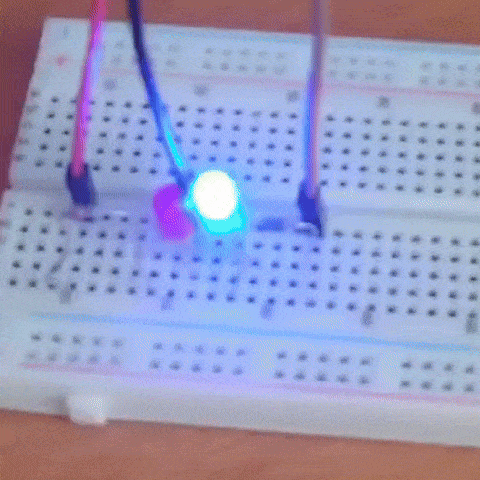

# modified-police-light

Модифікована версія basic-police-light з ускладненим паттерном миготіння світлодіодів.

## Плата

- `esp32-s3-devkitc-1-n16r8v`
- Середовище PlatformIO: `esp32-s3-devkitc-1-n16r8v`

## Підключені до плати присторої

- Червоний світлодіод підключено до GPIO `15`
- Синій світлодіод підключено до GPIO `16`

## Робота

Код вмикає та вимикає червоний і синій світлодіоди у заданій послідовності, створюючи ефект миготіння.

