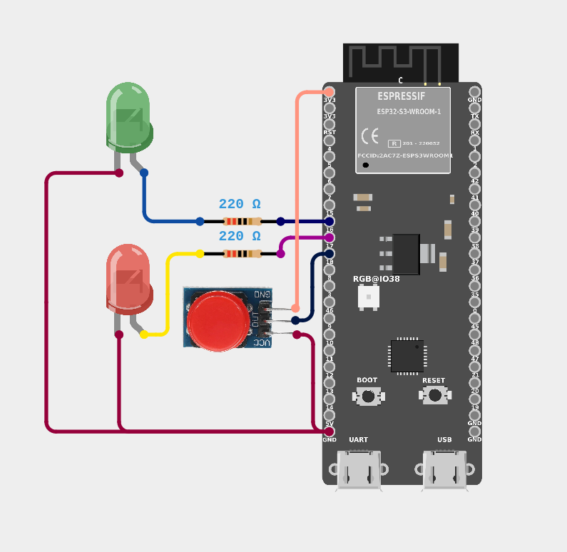

# ДЗ Модуль 1.4; Анищенко М.О.

# Базове завдання

### Вимоги

1. Під’єднати два світлодіоди до будь-яких вихідних GPIO ESP32.
2. Під’єднати зовнішню кнопку до GPIO.
3. Використати кнопку BOOT (GPIO0) як другу кнопку без додаткового підключення.
4. Реалізувати два режими миготіння світлодіодів: режим, що активується зовнішньою кнопкою; режим, що активується кнопкою BOOT.
5. При натисканні зовнішньої кнопки перемикати LEDs у швидший режим миготіння.
6. При натисканні кнопки BOOT перемикати LEDs у повільніший режим миготіння.
7. Миготіння реалізувати через delay().
8. Усунути брязкіт контактів кнопок (затримка після спрацювання кнопки).*


### Вирішення
ВІДЕО РОБОТИ: [https://youtu.be/FgJ2tAY0QTY](https://youtu.be/FgJ2tAY0QTY)

**Проект:** [gpio_basic](gpio_basic)

Кнопки підключено до пінів 17 та 0 з використанням переривань за спадом сигналу (NEGEDGE).
Кнопка на піні 0 (BOOT) встановлює повільний режим мерехтіння (1000мс).
Кнопка на піні 17 встановлює швидкий режим мерехтіння (300мс).

Обробники переривань реалізовано з використанням API ESP-IDF.
Кожен обробник позначено атрибутом `IRAM_ATTR`, що забезпечує виконання коду з оперативної пам'яті (RAM) замість флеш-пам'яті.
Це необхідно для мінімізації затримки виконання ISR.

Глобальна змінна `current_blink_mode` оголошена як `volatile`, що гарантує її читання з пам'яті при кожному зверненні (оптимізатор компілятора не кешує її значення).

Для запобігання багаторазовим зчитуванням кнопки використовується програмна затримка 200мс.
Кожен обробник зберігає час останнього спрацювання у статичній змінній `lastTriggeredTime`.
При спрацюванні переривання порівнюється поточний час з часом останнього спрацювання.
Якщо різниця перевищує 200мс, змінна `current_blink_mode` оновлюється.

```c
void IRAM_ATTR next_button_isr(void *arg) {
    static int lastTriggeredTime = 0;
    int now = esp_timer_get_time();
    if (now - lastTriggeredTime > DEBOUNCE_DELAY_MS) {
        lastTriggeredTime = now;
        current_blink_mode = SLOW;
    }
}
```

#### Схема


Зовнішня кнопка, що була в копмлекті, вже має вбудований резистор на піні підписаному **GND**, тож немає необхідності в додатковому "підтягуючому резисторі".
Також, оскільки я хотів отримати однакову логіку обробки для обох кнопок(**BOOT** пропускає струм в неактивному стані), я підключив зовнішня кнопку в "зворотньому напрямку": 
* **GND** кнопки до **3V3** плати
* **3V3** кнопки до **GND** плати

# Додаткові завдання

### Вимоги

1. Додати третій режим, який активується довгим натисканням кнопки або одночасним натисканням обох кнопок.
2. Замість двох режимів реалізувати циклічне перемикання між трьома або більше швидкостями.
3. Додати вивід у Serial Monitor із повідомленням про вибраний режим.

### Вирішення

ВІДЕО РОБОТИ: [https://youtu.be/5AMlNgHUF-8](https://youtu.be/5AMlNgHUF-8)

**Проект:** [gpio_optional](gpio_optional)

#### Ітерація між швидкостями мерехтіння

Підтримується 4 швидкості мерехтіння, що зберігаються в масиві:
```c
#define NUMBER_OF_SPEED_MODES 4
const int blink_speeds[NUMBER_OF_SPEED_MODES] = {1000, 500, 250, 125};
volatile int current_blink_speed_idx = 0;
```

При натисканні кнопки **NEXT** індекс збільшується на 1 з циклічним перекриттям.
```c
current_blink_speed_idx = (current_blink_speed_idx + 1) % NUMBER_OF_SPEED_MODES;
```
При натисканні кнопки **PREV** індекс зменшується на 1 з циклічним перекриттям.
```c
current_blink_speed_idx = current_blink_speed_idx - 1 >= 0 ? current_blink_speed_idx - 1 : NUMBER_OF_SPEED_MODES-1;
```


#### Реєстрація одночасного натискання кнопок та перемикання режимів

Навідміну від базового завдяння, обробники переривань оновлюють часові мітки останнього натискання ф не впливають на стан напряму.
Основна логіка виконується у окремій задачі `input_controller`.
Задача преревіряє час останнього натискання кнопки записаний у змінній кожні 200мс, записує стан(натиснута чи ні) у відповідний біт змінної **state** та використовує отримане значення для визначення стану(1 біт - BOOT, 2 - зовнішня). Можливі стани:
* `0` *0000* - жодна кнопка не натиснута
* `1` *0001* - натиснута тільки кнопка NEXT (наступна швидкість)
* `2` *0010* - натиснута тільки кнопка PREV (попередня швидкість)
* `3` *0011* - натиснуті обидві кнопки (перемикання режиму)

```c
    static int last_controller_run = 0;
    int now = 0;
    int state = 0; //first bit - NEXT button, seconf bit - PREV button

    ESP_LOGI(CONTROLLER_TAG, "Controller initialized");

    // controller check for button press registred in time period beetween last_controller_run and now
    while (1) {
        vTaskDelay(pdMS_TO_TICKS(CONTROLLER_SCAN_PERIOD_MS));
        state = 0;
        now = esp_timer_get_time();

        // NEXT button was pressed in scanned period - set first bit
        if (last_next_triggered_time > last_controller_run && last_next_triggered_time < now) {
            state += (1 << 0);
        }

        // PREV button was pressed in scanned period - set second bit
        if (last_prev_triggered_time > last_controller_run && last_prev_triggered_time < now) {
            state += (1 << 1);
        }

        last_controller_run = now;

        switch (state) {    
            case 0: // if none were pressed - skip
                break;
            case 1: // if NEXT was pressed - next speed
                current_blink_speed_idx = (current_blink_speed_idx + 1) % NUMBER_OF_SPEED_MODES;
                ESP_LOGI(CONTROLLER_TAG, "Got 'NEXT' signal. Switching to speed %d", current_blink_speed_idx);
                break;
            case 2: // if PREV was pressed - previous speed
                current_blink_speed_idx = current_blink_speed_idx - 1 >= 0 ? current_blink_speed_idx - 1 : NUMBER_OF_SPEED_MODES-1;
                ESP_LOGI(CONTROLLER_TAG, "Got 'PREV' signal. Switching to speed %d", current_blink_speed_idx);
                break;
            case 3: // if both buttons were pressed in scanned period - perform mode change
                current_blink_mode = !(current_blink_mode || !1); // we have only two modes(0 and 1) so reverting value is enough
                ESP_LOGI(CONTROLLER_TAG, "Got 'MODE' signal. Switching to mode %d", current_blink_mode);
                break;
        }
    }
```

#### Логування

Використовується API логування ESP-IDF (`esp_log.h`), що записує логи у Serial
Два теги для різних компонентів системи:
* `main` - для повідомлень про ініціалізацію
* `controller` - для повідомлень про зміну стану

При зміні швидкості або режиму логується відповідне повідомлення:
```c
ESP_LOGI(CONTROLLER_TAG, "Got 'NEXT' signal. Switching to speed %d", current_blink_speed_idx);
ESP_LOGI(CONTROLLER_TAG, "Got 'MODE' signal. Switching to mode %d", current_blink_mode);
```

Приклад логів
```
I (8282) controller: Got 'PREV' signal. Switching to speed 3
I (13082) controller: Got 'NEXT' signal. Switching to speed 0
I (15682) controller: Got 'NEXT' signal. Switching to speed 1
I (17282) controller: Got 'PREV' signal. Switching to speed 0
I (17882) controller: Got 'PREV' signal. Switching to speed 3
I (18282) controller: Got 'PREV' signal. Switching to speed 2
I (19082) controller: Got 'MODE' signal. Switching to mode 1
I (21082) controller: Got 'NEXT' signal. Switching to speed 3
I (22082) controller: Got 'NEXT' signal. Switching to speed 0
I (23082) controller: Got 'MODE' signal. Switching to mode 0
I (25082) controller: Got 'PREV' signal. Switching to speed 3
```

#### Схема
Аналогічна до схеми з базового завдання