# ДЗ Модуль 1.4; Анищенко М.О.

## Хід роботи

ВІДЕО РОБОТИ: [https://youtu.be/rsE1tHXs96Q](https://youtu.be/rsE1tHXs96Q)

### Код
Проект: [click-counter](click-counter)

``` c
#include <stdio.h>
#include <string.h>
#include <stdlib.h>
#include <inttypes.h>
#include "freertos/FreeRTOS.h"
#include "driver/gpio.h"
#include <esp_timer.h>
#include "esp_log.h"

#define BUTTON_PIN 15
#define COUNTER_TAG "counter"

void button_isr_handler(void *args) {
    static uint8_t counter = 0;
    int64_t click_timer = esp_timer_get_time(); // save triggered time
    counter++; // increment counter
    ESP_EARLY_LOGI(COUNTER_TAG, "Button was pressed. Counter: %2d; Click time: %d", counter, click_timer); // log count and triggered time
}

void init() {
    gpio_config_t button = {
        .pin_bit_mask = 1 << BUTTON_PIN,
        .mode = GPIO_MODE_INPUT,
        .intr_type = GPIO_INTR_NEGEDGE,
        .pull_down_en = GPIO_PULLDOWN_DISABLE,
        .pull_up_en = GPIO_PULLUP_DISABLE // pullup is built into button
    };
    gpio_config(&button);

    gpio_install_isr_service(0);

    gpio_isr_handler_add(BUTTON_PIN, button_isr_handler, NULL);

}

void app_main() {
    init();
}
```

### Логи 
```
I (29412) counter: Button was pressed. Counter:  1; Click time: 29191227
I (29412) counter: Button was pressed. Counter:  2; Click time: 29191452
I (30472) counter: Button was pressed. Counter:  3; Click time: 30248808
I (31542) counter: Button was pressed. Counter:  4; Click time: 31322852
I (32472) counter: Button was pressed. Counter:  5; Click time: 32244925
I (33402) counter: Button was pressed. Counter:  6; Click time: 33175493
I (33402) counter: Button was pressed. Counter:  7; Click time: 33175710
I (34422) counter: Button was pressed. Counter:  8; Click time: 34203162
I (34422) counter: Button was pressed. Counter:  9; Click time: 34203384
I (35462) counter: Button was pressed. Counter: 10; Click time: 35241433
I (35462) counter: Button was pressed. Counter: 11; Click time: 35241652
I (35612) counter: Button was pressed. Counter: 12; Click time: 35388966
I (36462) counter: Button was pressed. Counter: 13; Click time: 36235486
I (37562) counter: Button was pressed. Counter: 14; Click time: 37343942
I (37712) counter: Button was pressed. Counter: 15; Click time: 37489156
I (38672) counter: Button was pressed. Counter: 16; Click time: 38449048
I (38672) counter: Button was pressed. Counter: 17; Click time: 38449261
```

### Сигнал на логічному аналізаторі
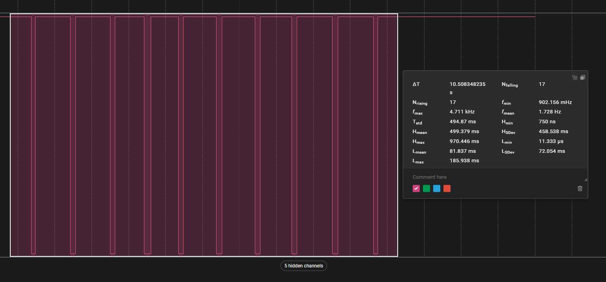
Capture файл: [misc/button_press_capture.sal](misc/button_press_capture.sal)

### Аналіз натискань

#### Натискання 1 
**К-ть спрацювань зареєстрованих контроллером:** 2 \
**К-ть спрацювань зареєстрованих аналізатором:** 2 \
**Тривалість брязкоту:** 0.23мс при натисканні кнопки \
**Скріншот запису логічного аналізатора:**
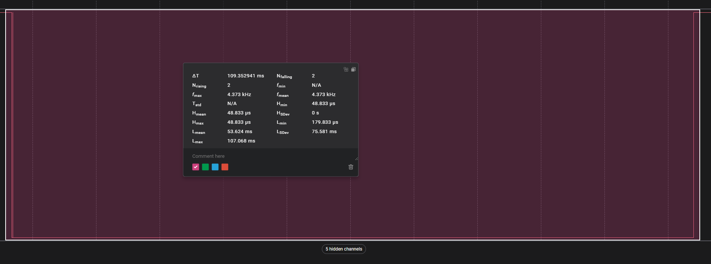
**Логи з мікроконтроллера:**
```
I (29412) counter: Button was pressed. Counter:  1; Click time: 29191227
I (29412) counter: Button was pressed. Counter:  2; Click time: 29191452
```

#### Натискання 2 
**К-ть спрацювань зареєстрованих контроллером:** 1 \
**К-ть спрацювань зареєстрованих аналізатором:** 1 \
**Тривалість брязкоту:** 0 \
**Скріншот запису логічного аналізатора:**
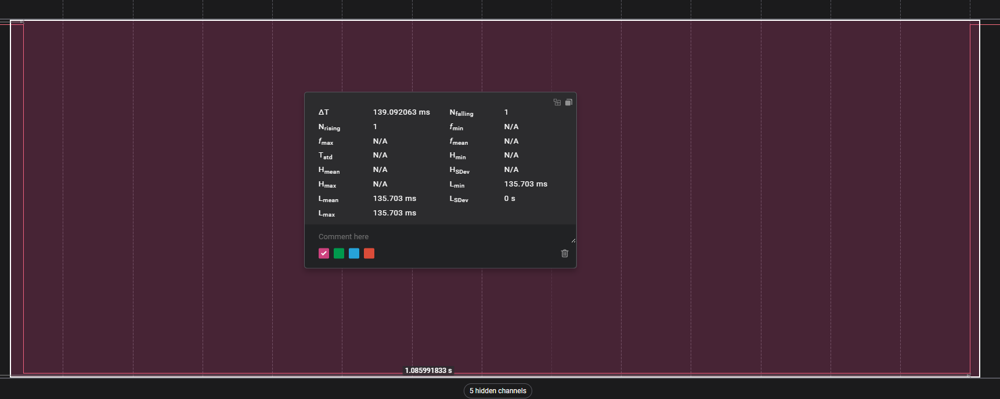
**Логи з мікроконтроллера:**
```
I (30472) counter: Button was pressed. Counter:  3; Click time: 30248808
```

#### Натискання 3 
**К-ть спрацювань зареєстрованих контроллером:** 1 \
**К-ть спрацювань зареєстрованих аналізатором:** 1 \
**Тривалість брязкоту:** 0 \
**Скріншот запису логічного аналізатора:**
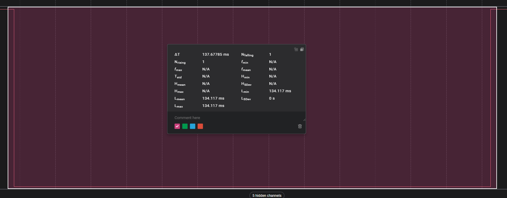
**Логи з мікроконтроллера:**
```
I (31542) counter: Button was pressed. Counter:  4; Click time: 31322852
```

#### Натискання 4 
**К-ть спрацювань зареєстрованих контроллером:** 1 \
**К-ть спрацювань зареєстрованих аналізатором:** 1 \
**Тривалість брязкоту:** 0 \
**Скріншот запису логічного аналізатора:**
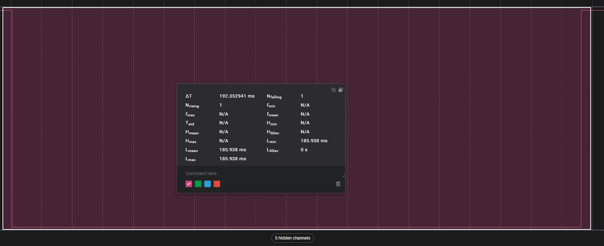
**Логи з мікроконтроллера:**
```
I (32472) counter: Button was pressed. Counter:  5; Click time: 32244925
```

#### Натискання 5 
**К-ть спрацювань зареєстрованих контроллером:** 2 \
**К-ть спрацювань зареєстрованих аналізатором:** 2 \
**Тривалість брязкоту:** 0.22мс при натисканні кнопки \
**Скріншот запису логічного аналізатора:**
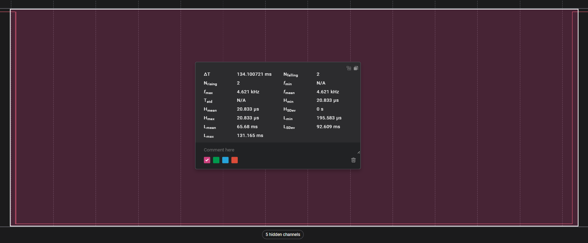
**Логи з мікроконтроллера:**
```
I (33402) counter: Button was pressed. Counter:  6; Click time: 33175493
I (33402) counter: Button was pressed. Counter:  7; Click time: 33175710
```

#### Натискання 6
**К-ть спрацювань зареєстрованих контроллером:** 2 \
**К-ть спрацювань зареєстрованих аналізатором:** 2 \
**Тривалість брязкоту:** 0.22мс при натисканні кнопки \
**Скріншот запису логічного аналізатора:**
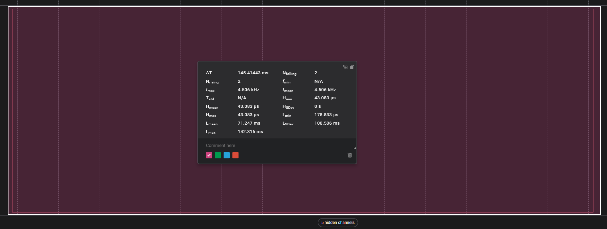
**Логи з мікроконтроллера:**
```
I (34422) counter: Button was pressed. Counter:  8; Click time: 34203162
I (34422) counter: Button was pressed. Counter:  9; Click time: 34203384
```

#### Натискання 7
**К-ть спрацювань зареєстрованих контроллером:** 3 \
**К-ть спрацювань зареєстрованих аналізатором:** 3 \
**Тривалість брязкоту:** 0.22мс при натисканні і 0.01мс при відпусканні кнопки \
**Скріншот запису логічного аналізатора:**
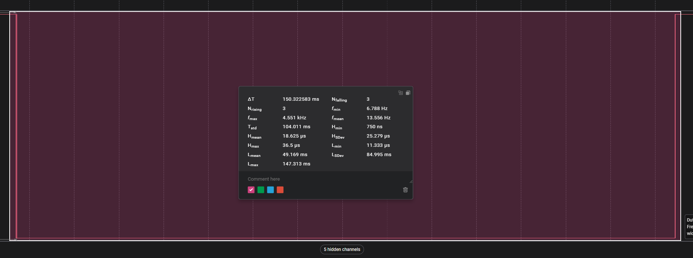
**Логи з мікроконтроллера:**
```
I (35462) counter: Button was pressed. Counter: 10; Click time: 35241433
I (35462) counter: Button was pressed. Counter: 11; Click time: 35241652
I (35612) counter: Button was pressed. Counter: 12; Click time: 35388966
```

#### Натискання 8
**К-ть спрацювань зареєстрованих контроллером:** 1 \
**К-ть спрацювань зареєстрованих аналізатором:** 1 \
**Тривалість брязкоту:** 0 \
**Скріншот запису логічного аналізатора:**
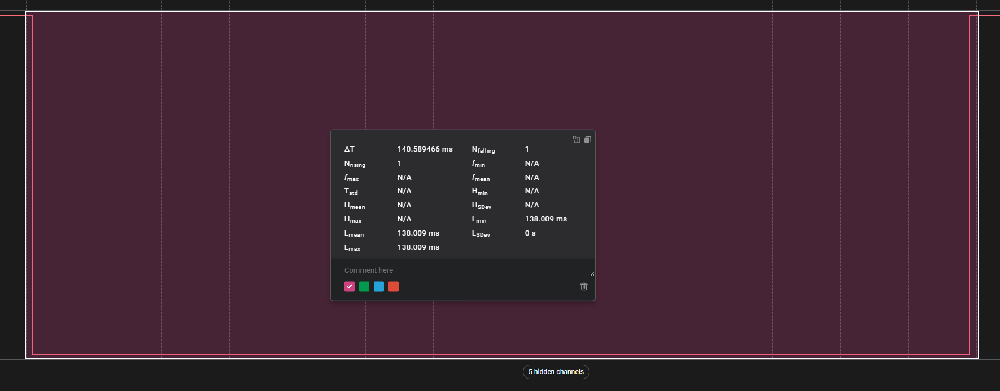
**Логи з мікроконтроллера:**
```
I (36462) counter: Button was pressed. Counter: 13; Click time: 36235486
```

#### Натискання 9
**К-ть спрацювань зареєстрованих контроллером:** 2 \
**К-ть спрацювань зареєстрованих аналізатором:** 2 \
**Тривалість брязкоту:** 0.18мс при відпусканні кнопки \
**Скріншот запису логічного аналізатора:**
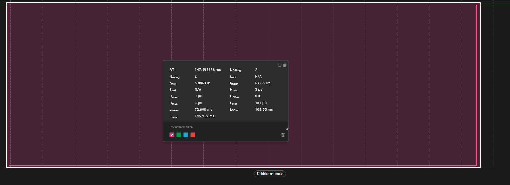
**Логи з мікроконтроллера:**
```
I (37562) counter: Button was pressed. Counter: 14; Click time: 37343942
I (37712) counter: Button was pressed. Counter: 15; Click time: 37489156
```

#### Натискання 10
**К-ть спрацювань зареєстрованих контроллером:** 2 \
**К-ть спрацювань зареєстрованих аналізатором:** 2 \
**Тривалість брязкоту:** 0.22мс при натисканні кнопки \
**Скріншот запису логічного аналізатора:**
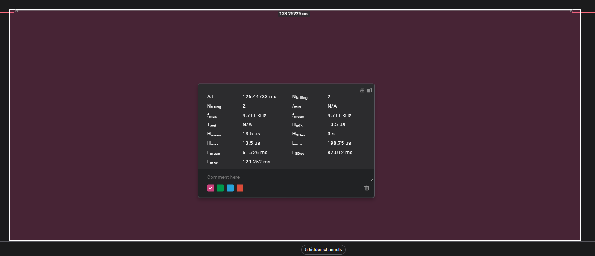
**Логи з мікроконтроллера:**
```
I (38672) counter: Button was pressed. Counter: 16; Click time: 38449048
I (38672) counter: Button was pressed. Counter: 17; Click time: 38449261
```

### Питання для аналізу

#### Чи співпадає кількість імпульсів?
Так, кількість імпульсів що реєструється логічним аналізатором і мікроконтроллером співпадає

#### У яких випадках мікроконтролер «пропускає» частину брязкоту, а коли навпаки — «перерахує зайве»?
Під час проведення декількох "прогонів" таких ситуацій не виникало. Потенційно такі ситуації можуть виникати через:
* частоту "пулінгу" сингалу на вході, в такому випадку контроллер може "пропускати" деякі спрацювання
* частоту дискретизації логічного аналізатора, в такому випадку аналізатор може "пропускати" деякі спрацювання
* GPIO не гарантує роспізнавання сигналів тривалстю менше 20нс, в той час як логічний аналізатор, належної якості, може їх реєструвати
* якщо, при надходженні нового сигналу, обробник переривання від попереднього сигналу ще виконується, контроллер не викличе його повторно, тож "пропустить" одне з спрацюваннь 
* різні пороги HIGH\LOW на мікроконтроллері і аналізаторі

#### Яка середня тривалість брязкоту для вашої кнопки?
0.22мс при натисканні і 0.09мс при відпусканні

#### Який мінімальний debounce (затримка / логіка фільтрації) був би достатній?
Судячи з отриманих даних достатньо було б не реагувати на сигнал що триває менш ніж 0.3мс, але рекомендується використовувати значення затримки в діапазоні 5-10мс. Зважаючи на продемонстровану якість кнопки, значення в 5мс було б достатнє

# Додаткові завдання

## Запустити другий варіант коду з програмним debounce (наприклад, 5–10 мс) і переконатися, що кількість імпульсів на виході стає рівно 1.

ВІДЕО РОБОТИ: [https://youtu.be/5loQzBrmjcQ](https://youtu.be/5loQzBrmjcQ)

### Код
Проект: [click-counter-with-debounce](click-counter-with-debounce)

Для імплементації программного дебаунсінгу використано підхід при якому обробник переривання `button_isr_handler`, замість виконання бізнес-логіки безпосередньо, нотифікує окрему задачу `counter_task`. Після отримання нотифікації, задача витримує задану дебаунс затримку і перевіряє чи стан кнопки відповідає логічному 0(кнопка натиснута) і тільки у випадку якщо це так - виконує бізнес-логіку. Додатково, на час роботи обробника і задачі, переривання для піна з кнопкою вимикаються, щоб ігнорувати додаткові спрацювання викликані брязкотом. \
Також, оскільки platformio за замовчуванням ініціалізує контроллер з частотою 100Гц, недостатньою для обробки 5мс затримки, додано логіку що забезпечує хоча б один такт затримки на цей випадок. \
Заміри проводились на мікроконтроллері з частотою 1000Гц і затримкою дебаунсу 5мс

``` c
#include <stdio.h>
#include <string.h>
#include <stdlib.h>
#include <inttypes.h>
#include "freertos/FreeRTOS.h"
#include "driver/gpio.h"
#include <esp_timer.h>
#include "esp_log.h"

#define DEFAULT_DEBOUNCE_MS 5 // default debounce in ms. This value can be ignored if controller's tickrate is lover then 200Hz
#define BUTTON_PIN 15
#define COUNTER_TAG "counter"
#define INIT_TAG "init"

static int DEBOUNCE_TICKS = 0; // debounce in ticks. Calculated upon init

static TaskHandle_t counter_task_handle = NULL;

void button_isr_handler(void *args) {
    // disable interrupt to prevent additional button presses before counter handles current one
    gpio_intr_disable(BUTTON_PIN); 

    // notify counter task
    BaseType_t xHigherPriorityTaskWoken = pdFALSE;
    vTaskNotifyGiveFromISR(counter_task_handle, &xHigherPriorityTaskWoken);

    // check if woken task has higher priority, if so - immediately switch to it
    if (xHigherPriorityTaskWoken) {
        portYIELD_FROM_ISR();
    }
}

void counter_task(void *params) {
    static uint8_t counter = 0;
    while(1) {
        ulTaskNotifyTake(pdTRUE, portMAX_DELAY); // wait for notification from interrupt
        vTaskDelay(DEBOUNCE_TICKS);  // wait for debounce delay

        // increment counter only if button is still pressed after debounce period
        if(gpio_get_level(BUTTON_PIN) == 0) {
            counter++;
            ESP_LOGI(COUNTER_TAG, "Button was pressed. Counter: %2d; Click time: %d", counter, esp_timer_get_time());
        }

        gpio_intr_enable(BUTTON_PIN);
    }
}

void init() {

    // if tickrate is to low to get 5ms debounce - set debounce of 1 tick
    DEBOUNCE_TICKS = pdMS_TO_TICKS(DEFAULT_DEBOUNCE_MS);
    if (DEBOUNCE_TICKS == 0) {
        DEBOUNCE_TICKS = 1;
    }
    ESP_LOGI(INIT_TAG, "Debounce delay: %dms", DEBOUNCE_TICKS*1000/configTICK_RATE_HZ);

    gpio_config_t button = {
        .pin_bit_mask = 1 << BUTTON_PIN,
        .mode = GPIO_MODE_INPUT,
        .intr_type = GPIO_INTR_NEGEDGE,
        .pull_down_en = GPIO_PULLDOWN_DISABLE,
        .pull_up_en = GPIO_PULLUP_DISABLE // pullup is built into button
    };
    gpio_config(&button);

    xTaskCreatePinnedToCore(
        counter_task,
        "counter_task",
        2048,
        NULL,
        10,
        &counter_task_handle,
        1
    );

    gpio_install_isr_service(0);
    gpio_isr_handler_add(BUTTON_PIN, button_isr_handler, NULL);

}

void app_main() {
    init();
}
```

### Логи
```
I (32107) counter: Button was pressed. Counter:  1; Click time: 31883815
I (33298) counter: Button was pressed. Counter:  2; Click time: 33074812
I (34645) counter: Button was pressed. Counter:  3; Click time: 34421812
I (35854) counter: Button was pressed. Counter:  4; Click time: 35630812
I (37096) counter: Button was pressed. Counter:  5; Click time: 36872812
I (38362) counter: Button was pressed. Counter:  6; Click time: 38138812
I (39660) counter: Button was pressed. Counter:  7; Click time: 39436812
I (40980) counter: Button was pressed. Counter:  8; Click time: 40756812
I (42238) counter: Button was pressed. Counter:  9; Click time: 42014812
I (43518) counter: Button was pressed. Counter: 10; Click time: 43294812
```

### Сигнал


### Результат
Як можна побачити на зображенні та в логах - логічний аналізатор фіксує 14 "спрацювань" кнопки, в той час як мікрокотроллер лише заплановані 10. 

## Додати резистор та конденсатор і переконатися у відсутності брязкоту.

ВІДЕО РОБОТИ: [https://youtu.be/oHHaER8vAMs](https://youtu.be/oHHaER8vAMs)

Для досягнення дебаунсу на рівні "заліза", використав RC фільтр додавши відповідний конденсатор на 100нФ(~1мс дебаунс) параллельно до входу GPIO і землі. \
Оскільки допуски для рівнів логічної 1 та 0 в esp32 доволі великі, використання такого фільтру без додаткового дебаунсу в коді, або триггеру Шмітта, призведе до багаторазових зчитувань "спарцювання кнопки" через те, що конденсатор, в процессі зарядки і розрядки, якись час все ще даватиме достатній рівень сигналу для спрацьовування переривання.

### Код
Проект: [click-counter-with-debounce](click-counter-with-debounce)

Аналогічний до попереднього завдання 

### Схема 

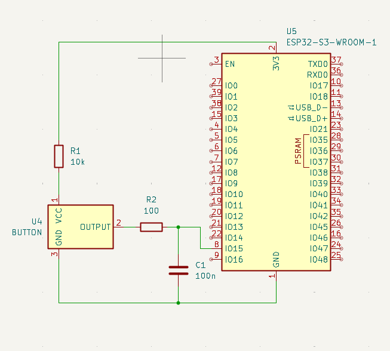

### Лог
```
I (25021) counter: Button was pressed. Counter:  1; Click time: 24797815
I (26058) counter: Button was pressed. Counter:  2; Click time: 25834812
I (27083) counter: Button was pressed. Counter:  3; Click time: 26859812
I (28121) counter: Button was pressed. Counter:  4; Click time: 27897812
I (29028) counter: Button was pressed. Counter:  5; Click time: 28804812
I (30093) counter: Button was pressed. Counter:  6; Click time: 29869812
I (31200) counter: Button was pressed. Counter:  7; Click time: 30976812
I (32237) counter: Button was pressed. Counter:  8; Click time: 32013812
I (33361) counter: Button was pressed. Counter:  9; Click time: 33137812
I (34390) counter: Button was pressed. Counter: 10; Click time: 34166812
```

### Сигнал


### Результат
Як можна побачити на зображенні та в логах - як логічний аналізатор так і мікроконтроллер фіксують 10 "спрацювань" кнопки, як і заплановано. 