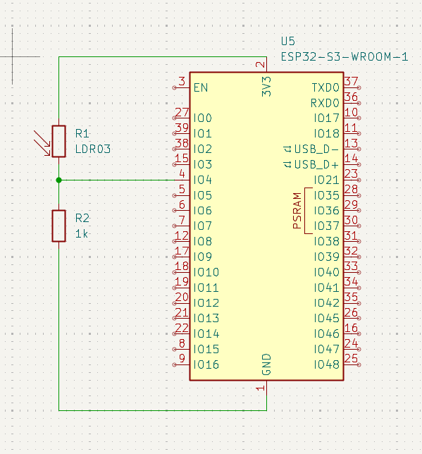

# ДЗ Модуль 1.6; Анищенко М.О.

## Хід роботи

ВІДЕО РОБОТИ: [https://youtube.com/shorts/VjEa9k2tOrE?feature=share](https://youtube.com/shorts/VjEa9k2tOrE?feature=share)

Проект: [adc-basic-esp32](adc-basic-esp32)

### Код

``` c
#include <stdlib.h>
#include <Arduino.h>

const int adcPin = 4; // GPIO 4 (ADC1 Channel 3)

void setup() {
  Serial.begin(115200);
  analogSetAttenuation(ADC_11db); // Set max range to ~3.3V
  Serial.printf("|  Raw | Caclculated Voltage | Measured Voltage |  Error |\n");
}

void loop() {
  uint16_t rawValue = analogRead(adcPin);
  float measuredVoltage = (float)analogReadMilliVolts(adcPin)/1000;
  float calculatedVoltage = rawValue * (3.3 / 4095.0); // 12-bit resolution
  float absoluteError = abs(calculatedVoltage - measuredVoltage) / measuredVoltage;
  
  Serial.printf("| %4d | %19.2f | %16.2f | %5.1f%% |\n", rawValue, calculatedVoltage, measuredVoltage, absoluteError*100);
  delay(1000);
}
```

### Схема
Вимірявши мультиметром значення опору фоторезистора в різних умовах, було визначено що при яскравому світлі його опір складає `500Ом`; при денному світлі `1кОм`; при слабкому освітлені `5кОм`. \
Для отримання зручного діапазону показників, де `Vcc/2` відповідатиме денному світлу, було підібрано pull-down резистор на `1кОм`  



### Логи

```
|  Raw | Caclculated Voltage | Measured Voltage |  Error |
| 1913 |                1.54 |             1.62 |   4.8% |
| 1854 |                1.49 |             1.57 |   5.0% |
| 1845 |                1.49 |             1.57 |   5.0% |
| 1847 |                1.49 |             1.57 |   4.9% |
| 1845 |                1.49 |             1.57 |   5.1% |
| 1847 |                1.49 |             1.57 |   4.9% |
|  895 |                0.72 |             0.77 |   6.3% |
|  784 |                0.63 |             0.68 |   7.5% |
|  797 |                0.64 |             0.69 |   7.3% |
|  811 |                0.65 |             0.70 |   6.4% |
|  830 |                0.67 |             0.71 |   5.9% |
|  830 |                0.67 |             0.73 |   7.7% |
| 1860 |                1.50 |             1.57 |   4.7% |
| 1853 |                1.49 |             1.57 |   5.0% |
| 1855 |                1.49 |             1.57 |   4.9% |
| 2835 |                2.28 |             2.38 |   4.0% |
| 2831 |                2.28 |             2.38 |   4.1% |
| 2829 |                2.28 |             2.38 |   4.0% |
| 2827 |                2.28 |             2.38 |   4.1% |
| 2828 |                2.28 |             2.38 |   4.1% |
| 2830 |                2.28 |             2.38 |   4.1% |
| 2823 |                2.27 |             2.37 |   4.1% |
| 1855 |                1.49 |             1.57 |   4.7% |
| 1848 |                1.49 |             1.57 |   5.0% |
| 1848 |                1.49 |             1.57 |   5.1% |
| 1850 |                1.49 |             1.57 |   4.9% |
| 1849 |                1.49 |             1.57 |   4.9% |
| 1848 |                1.49 |             1.57 |   5.0% |
| 1851 |                1.49 |             1.57 |   4.9% |
| 1851 |                1.49 |             1.57 |   4.9% |
| 1853 |                1.49 |             1.57 |   5.0% |
| 1855 |                1.49 |             1.57 |   5.0% |
| 1861 |                1.50 |             1.57 |   4.7% |
| 1862 |                1.50 |             1.58 |   4.9% |
| 1855 |                1.49 |             1.57 |   5.0% |
| 1853 |                1.49 |             1.57 |   5.0% |
```

### Результат
В змішаних умовах похибка склала `5.08%`. Оскільки було обрано резистор з опором `1кОм`, для отримання середнього значення напруги при денному освітленні. Похибка є більшою(`~7.5%`) для вимірів низької освітленості  

# Додаткове завдання

### 10 Біт

Зниження бітності до 10 біт некритично повпливало на похибку, середня похибка в змішаних умовах становила `5.48%`, що лише на `0.4%` більше ніж при 12 бітах. \
Бітнісь малопомітно повпливала на точність, для наявного випадку, але зменшення роздільної здатності значень може бути критичним для точних приладів.

```
|  Raw | Caclculated Voltage | Measured Voltage |  Error |
|  479 |                1.55 |             1.62 |   4.9% |
|  482 |                1.55 |             1.64 |   5.0% |
|  482 |                1.55 |             1.63 |   4.9% |
|  481 |                1.55 |             1.63 |   5.1% |
|  202 |                0.65 |             0.70 |   6.9% |
|  183 |                0.59 |             0.64 |   7.8% |
|  183 |                0.59 |             0.63 |   7.0% |
|  185 |                0.60 |             0.64 |   7.5% |
|  182 |                0.59 |             0.63 |   7.0% |
|  183 |                0.59 |             0.64 |   7.2% |
|  181 |                0.58 |             0.64 |   8.2% |
|  187 |                0.60 |             0.63 |   5.0% |
|  180 |                0.58 |             0.63 |   8.0% |
|  180 |                0.58 |             0.62 |   6.9% |
|  480 |                1.55 |             1.63 |   5.1% |
|  481 |                1.55 |             1.63 |   4.9% |
|  479 |                1.55 |             1.62 |   4.9% |
|  478 |                1.54 |             1.62 |   4.8% |
|  495 |                1.60 |             1.68 |   5.0% |
|  649 |                2.09 |             2.19 |   4.2% |
|  649 |                2.09 |             2.19 |   4.5% |
|  650 |                2.10 |             2.19 |   4.4% |
|  650 |                2.10 |             2.19 |   4.4% |
|  650 |                2.10 |             2.19 |   4.5% |
|  638 |                2.06 |             2.15 |   4.4% |
|  642 |                2.07 |             2.17 |   4.5% |
|  476 |                1.54 |             1.61 |   4.8% |
|  476 |                1.54 |             1.62 |   5.1% |
|  477 |                1.54 |             1.61 |   4.6% |
|  477 |                1.54 |             1.62 |   4.9% |
|  481 |                1.55 |             1.63 |   4.7% |
|  476 |                1.54 |             1.62 |   5.3% |
|  476 |                1.54 |             1.61 |   4.8% |
|  476 |                1.54 |             1.62 |   4.9% |
|  478 |                1.54 |             1.62 |   4.9% |
|  477 |                1.54 |             1.62 |   5.1% |
|  477 |                1.54 |             1.62 |   5.1% |
|  477 |                1.54 |             1.62 |   5.0% |
```

### 6 dB

Зниження атенюації критично впливає на точність вимірювання. Похибка зросла до 77.7% що є неприпустимо неточним. \
Напруга вирахувана з даних, отриманих з АЦП, майже вдвічі перевищує реальні показники.

```
|  Raw | Caclculated Voltage | Measured Voltage |  Error |
| 3507 |                2.83 |             1.58 |  79.0% |
| 3507 |                2.83 |             1.58 |  78.8% |
| 3503 |                2.82 |             1.58 |  78.6% |
| 3498 |                2.82 |             1.58 |  78.9% |
| 3501 |                2.82 |             1.58 |  78.9% |
| 3501 |                2.82 |             1.58 |  79.0% |
| 3500 |                2.82 |             1.58 |  78.7% |
| 1263 |                1.02 |             0.59 |  73.7% |
| 1277 |                1.03 |             0.59 |  74.4% |
| 1287 |                1.04 |             0.60 |  74.3% |
| 1279 |                1.03 |             0.59 |  75.3% |
| 1252 |                1.01 |             0.59 |  70.7% |
| 1289 |                1.04 |             0.59 |  75.5% |
| 1277 |                1.03 |             0.59 |  75.6% |
| 1266 |                1.02 |             0.58 |  74.7% |
| 1271 |                1.02 |             0.58 |  75.1% |
| 1270 |                1.02 |             0.58 |  74.9% |
| 3493 |                2.81 |             1.57 |  79.1% |
| 3493 |                2.81 |             1.58 |  78.6% |
| 3493 |                2.81 |             1.57 |  79.1% |
| 3902 |                3.14 |             1.75 |  79.5% |
| 4095 |                3.30 |             1.84 |  79.8% |
| 4095 |                3.30 |             1.84 |  79.8% |
| 4095 |                3.30 |             1.84 |  79.8% |
| 4095 |                3.30 |             1.84 |  79.8% |
| 4095 |                3.30 |             1.84 |  79.8% |
| 4095 |                3.30 |             1.84 |  79.8% |
| 3488 |                2.81 |             1.57 |  78.9% |
| 3483 |                2.81 |             1.57 |  78.9% |
| 3483 |                2.81 |             1.57 |  78.9% |
| 3483 |                2.81 |             1.57 |  78.8% |
| 3497 |                2.82 |             1.58 |  78.9% |
| 3503 |                2.82 |             1.58 |  79.1% |
```