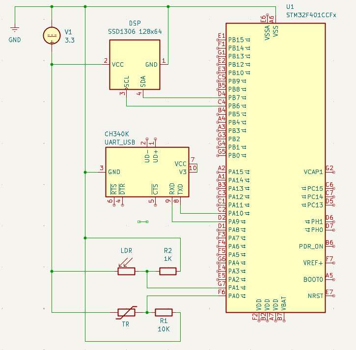
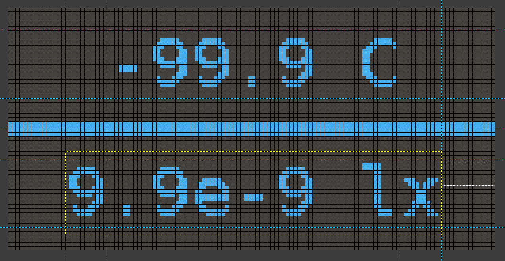

# Зміст
- [Зміст](#зміст)
- [Опис](#опис)
- [Принцип роботи](#принцип-роботи)
  - [Схема підключення](#схема-підключення)
      - [Живлення](#живлення)
      - [DSP](#dsp)
      - [USB-UART](#usb-uart)
      - [LDR](#ldr)
      - [TR](#tr)
  - [Обробка вхідних даних](#обробка-вхідних-даних)
    - [Serial вивід](#serial-вивід)
    - [Вивід на дисплей](#вивід-на-дисплей)


# Опис
ПРОЕКТ: [temp_light_display](temp_light_display)
ВІДЕО РОБОТИ: [https://youtu.be/yaor4GPJiNk](https://youtu.be/yaor4GPJiNk) 

Плата кожні 1000мс знімає показники з фото- і терморезистора і розраховує значення відповідних величин. Отримані значення виводяться на екран та у Serial через USB-UART.

**Вхідні дані:** напруга через фоторезистор, напруга через терморезистор \
**Вихідні дані:** температура(Цельсій), освітленість(Люкс) \
**Спосіб представлення:** Екран, Serial(USB-UART)

**Основні компоненти:**
- Плата: *STM32F401CCU6*
- Сенсори: *Ntc Thermistor Mf5a-3* терморезистор, *GL5516* фоторезистор
- Виводи: *SSD1306* 128х64 екран, *USB-UART*

**Потенційні покращення:** додати годинник, додати звуковий сигнал при високих значеннях

# Принцип роботи

## Схема підключення

Для проекту використовується STM32F401CCU6, OLED-дисплей SSD1306 з інтерфейсом I²C, USB-UART на CH340K та два аналогові датчики — LDR і терморезистор.



#### Живлення

Для живлення плати використовується **ST-Link V2**, датчики та екран живляться від зовнішнього джерела **V1** з напругою 3.3В. 

#### DSP
Дисплей підключено до стандартних портів I2C 
```
PB6 → I2C1_SCL
PB7 → I2C1_SDA
```

#### USB-UART
USB-UART пристрій підключено перехресно до відповідних UART пінів
```
PA09/TX → CH340K/RXD
PA10/RX → CH340K/TXD
```

#### LDR
Фоторезистор та pull-down резистор R2 утворюють дільник напруги. Резистор з значенням 1кОм було підібрано для отримання вищої точності в побутовому діапазоні значень освітленості
```
PA1 → ADC
```

#### TR
Термістор та pull-down резистор R1 утворюють дільник напруги. Резистор з значенням 10кОм було підібрано згідно з рекомендаціями з даташіта.
```
PA0 → ADC
```

## Обробка вхідних даних

Для отримання показників з сенсорів використовуються 2 канали АЦП, *канал №1* зчитує показники з термістора, *канал №2* - з фоторезистора. Використовуючи *DMA* дані з цих каналів постійно записуються в буфер, з якого вони вичитуються і передаються на обробку в головному циклі.

``` c
uint16_t raw[2];
HAL_StatusTypeDef adc_status = HAL_ADC_Start_DMA(&hadc1,(uint32_t *)raw, 2);
while (1)
{
..............................................
    get_calculated_sensor_values(raw, values);
..............................................
}
```

Функція `get_calculated_sensor_values` розраховує значення відповідних фізичних величин і закписує їх у переданий другим параметром масив
``` c
void get_calculated_sensor_values(uint16_t* raw, float* output) {
	uint16_t temp_raw = raw[TEMPERATURE_IDX];
	uint16_t illum_raw = raw[ILLUMINANCE_IDX];
	print_raw_sensor_data(temp_raw, illum_raw);

	output[TEMPERATURE_IDX] = calculate_temperature(temp_raw);
	output[ILLUMINANCE_IDX] = calculate_illuminance(illum_raw);
}

```

Функція розрахунку температури з показників термістора по формулі Штейнхарта-Харта. коефіцієнти *A*,*B*,*C* були розраховані з результатів експериментів з наданим термістором
``` c
static float calculate_temperature (uint16_t raw) {
	#define SHC_A 1.785753086e-3f
	#define SHC_B 1.242576425e-4f
	#define SHC_C 5.424282270e-7f

	float r = TEMP_PULLDOWN_R * ((float)QUANTIZATION/raw - 1);
	float t_K = 1.0 / (SHC_A + SHC_B*log(r) + SHC_C*pow(log(r), 3.0));
	return t_K - 273.15;
}
```

Функція розразунку освітленості з показників фоторезистора. коефіцієнт *A* був розрахований з результату експерименту з наданим фоторезистором, чутливість була знайдена в даташиті
``` c
static float calculate_illuminance(uint16_t raw) {
	#define LDR_SENSITIVITY 0.5f
	#define LDR_A 15811

	float r = LIGHT_PULLDOWN_R * ((float)QUANTIZATION/raw - 1);
	return pow(LDR_A/r, 1/LDR_SENSITIVITY);
}
```

### Serial вивід

Serial вивід реалізовано по протоколу UART через зовнішній USB-UART адаптер.
Функція `print_to_serial` форматує та записує повідомлення в буфер, після чого передає цей буфер до HAL функції що відправляє їх по UART
``` c
void print_to_serial(const char * msg, ...) {
	static uint8_t outputBuffer[100] = {0};

	va_list args;
	va_start(args, msg);
	vsnprintf(outputBuffer, 100, msg, args);
    va_end(args);

    HAL_UART_Transmit(huart, (uint8_t *)outputBuffer, strlen(outputBuffer), HAL_MAX_DELAY);
}
```

### Вивід на дисплей

**Макет виводу на екран:**

Файл макету: [media/oled_ui_prototype.xcf](media/oled_ui_prototype.xcf) \
Розмір шрифта: 11x18 \
Температура: цельсій, діапазон [-99.9;+99.9] + 1 символ для `C` \
Освітленість: люкс, діапазон [9.9*е-9;9.9*е+9], використовуючи `E notation` для зменшення кількості символів

**Реалізація:**
В якості дисплею використовується *SSD1306* 128х64 екран, для зручної роботи з ним було використано драйвер [ssd1306-stm32HAL](https://github.com/4ilo/ssd1306-stm32HAL). Цей драйвер надає можливість виводити текст заготовленими шрифтами і проставляти значення окремих пікселів. Це дає можливість спростити код роботи з екраном.

Функція що малює горизонтальний розділювач
``` c
static void draw_divider() {
	#define DIVIDER_START_X 0
	#define DIVIDER_START_Y 30
	#define DIVIDER_END_X 125
	#define DIVIDER_END_Y 34

	for (int x = DIVIDER_START_X; x <= DIVIDER_END_X; x++) {
		for (int y = DIVIDER_START_Y; y < DIVIDER_END_Y; y++) {
			ssd1306_DrawPixel(x, y, TEXT_COLOR);
		}
	}
}
```

Функція що малює значення температури
```c
static void draw_temperature(float temp) {
	#define TEMP_TEXT_START_X 26
	#define TEMP_TEXT_START_Y 6
	static char buf[7];

	ssd1306_SetCursor(TEMP_TEXT_START_X, TEMP_TEXT_START_Y);
	sprintf(buf, "%+3.1f C", temp);
	ssd1306_WriteString(buf, Font_11x18, TEXT_COLOR);
}
```

Функція що малює значення освітленості
``` c
static void draw_illumunance(float illum) {
	#define ILLUM_TEXT_START_X 15
	#define ILLUM_TEXT_START_Y 40
	static char buf[9];

	ssd1306_SetCursor(ILLUM_TEXT_START_X, ILLUM_TEXT_START_Y);
	sprintf(buf, "%.1e lx", illum);
	ssd1306_WriteString(buf, Font_11x18, TEXT_COLOR);
}
``` 
