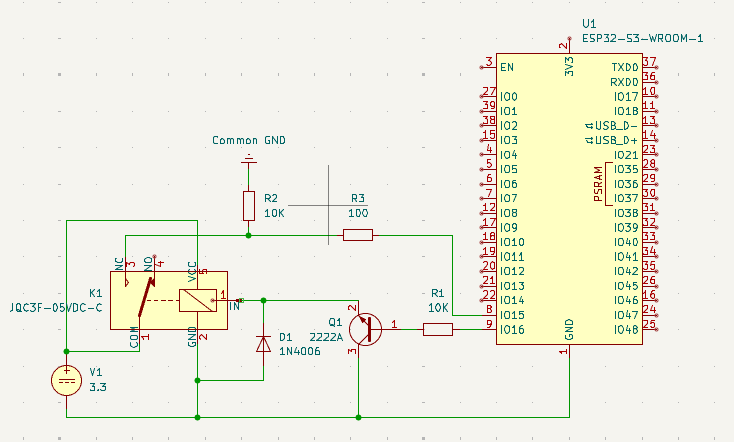
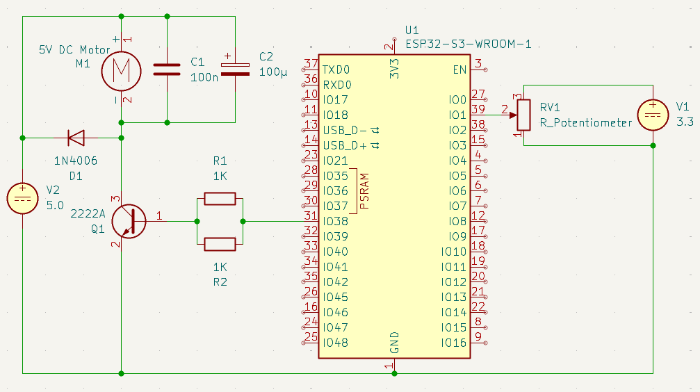

# ДЗ Модуль 2.2; Анищенко М.О.

## Основне завдання

ВІДЕО РОБОТИ: [https://youtube.com/shorts/SYNLRO0d6cI?feature=share](https://youtube.com/shorts/SYNLRO0d6cI?feature=share) \
ПРОЕКТ: [relay-rw/src/main.c](relay-rw/src/main.c)

### Схема

*Виходи:* до піна **16** підключено базу транзистора **Q1**, до еммітера транзистора підключено вхід реле **K1**. Також, для убезпечення піна від струму розряду котушки, параллельно до еммітра та землі, в зворотньому напрямку(анод до землі), підключено flyback-діод **D1**. \
*Входи:* **Normaly-Closed** вихід реле **K1** підключено до піна **15** з застосуванням **pull-down** резистора **R2**



### Код

**Запис міток часу:** \
Для запису часу зміни значення на виході реле використано переривання в режимі **GPIO_INTR_ANYEDGE**. Функція **handle_relay_input** обробляє переривання, воно записує мітку часу в момент зміни значення сигналу у массив **isr_triggered_timestamps**. Массив було використано бо реле схильне до брязкоту контактів, і запис лише одного значення не давав би повноти інформації. Також це дає можливість виміряти тривалість брязкоту контактів. \
Після кожної ітерації вимірювання, массив та вказівник на поточний індекс в ньому очищається функцією **clear_timestamps**

``` c
static volatile int64_t isr_triggered_timestamps[MAX_STORED_TIMESTAMPS] = {};
static volatile size_t writer_index = 0;
static volatile bool overflow = false;

void handle_relay_input(void *arg) {
    if (writer_index == MAX_STORED_TIMESTAMPS) {
        overflow = true;
        return;
    }
    isr_triggered_timestamps[writer_index] = esp_timer_get_time();
    writer_index++;
}

void clear_timestamps() {
    for (size_t i = 0; i < MAX_STORED_TIMESTAMPS; i++) {
        isr_triggered_timestamps[i] = 0;
    }
    writer_index = 0;
    overflow = false;
}
```

**В основному циклі програми:**
1. Інвертується сигнал що подається на пін
2. Одразу після зміни сигналу - записується мітка часу
3. Для запису усіх спрацювань переривання - контроллер очікує **COLLECT_RESULTS_DELAY**(1с)
4. В циклі відбувається прохід по всім записаним міткам часу записаним перериванням
    1. Якщо це перша мітка - виводиться різниця між нею і міткою з **п.2**. Це час від встановлення значення сигналу до першої події на виході реле
    2. Для кожного індексу виводиться індекс і мітка часу
    3. Якщо це остання мітка - виводиться різниця між нею і міткою з **п.2**. Це час від встановлення значення сигналу до досягнення стабільного значення сигналу на виході реле
5. Якщо переривання спацювало більше разів, ніж можливо було записати в масив - виводиться відповідне попередження
6. Вміст масиву та індекс очищається функцією **clear_timestamps**
7. Значення змінної, що зберігає значення піна, інвертується для наступної ітерації
8. Для зручності, викликається додаткова затримка між ітераціями вимірів

``` c
void app_main() {
    init();
    int iteration = 1;
    while (1) {
        static int set_pin_to = 1;

        ESP_LOGI(MEASUREMENTS_TAG, "-----------------------------------------");
        ESP_LOGI(MEASUREMENTS_TAG, "Iteration %d", iteration);

        gpio_set_level(OUTPUT_PIN, set_pin_to);
        uint64_t pin_set_timestamp = esp_timer_get_time();
        ESP_LOGI(MEASUREMENTS_TAG, "Pin level set to %d, at %lld. Collecting input...", set_pin_to, pin_set_timestamp);

        vTaskDelay(pdMS_TO_TICKS(COLLECT_RESULTS_DELAY));

        for (size_t i = 0; i < writer_index; i++) {
            if(i == 0) {
                ESP_LOGI(MEASUREMENTS_TAG, "Time to first switch: %lld", isr_triggered_timestamps[i] - pin_set_timestamp);
            }

            ESP_LOGI(MEASUREMENTS_TAG, "State changed i: %zu at: %lld", i, isr_triggered_timestamps[i]);

            if(i + 1 == writer_index) {
                ESP_LOGI(MEASUREMENTS_TAG, "Time to stable state: %lld", isr_triggered_timestamps[i] - pin_set_timestamp);
            }
        }

        if (overflow) {
            ESP_LOGW(MEASUREMENTS_TAG, "Got overflow");
        }
        
        clear_timestamps();
        set_pin_to = !set_pin_to;

        vTaskDelay(pdMS_TO_TICKS(MEASUREMENTS_DELAY));
        iteration++;
    }
}
```

### Лог

**Приклад логу:**
```
I (281) measurement: -----------------------------------------
I (281) measurement: Iteration 1
I (281) measurement: Pin level set to 1, at 61168. Collecting input...
I (1291) measurement: Time to first switch: 7621
I (1291) measurement: State changed i: 0 at: 68789
I (1291) measurement: State changed i: 1 at: 68807
I (1291) measurement: State changed i: 2 at: 68823
I (1291) measurement: State changed i: 3 at: 68880
I (1301) measurement: State changed i: 4 at: 68923 
I (1301) measurement: State changed i: 5 at: 69005
I (1311) measurement: State changed i: 6 at: 69083
I (1311) measurement: State changed i: 7 at: 69102
I (1311) measurement: State changed i: 8 at: 69117
I (1321) measurement: State changed i: 9 at: 70467
I (1321) measurement: State changed i: 10 at: 70854
I (1331) measurement: Time to stable state: 9686
I (2331) measurement: -----------------------------------------
I (2331) measurement: Iteration 2
I (2331) measurement: Pin level set to 0, at 2104968. Collecting input...
I (3331) measurement: Time to first switch: 1116
I (3331) measurement: State changed i: 0 at: 2106084
I (3331) measurement: Time to stable state: 1116
I (4331) measurement: -----------------------------------------
```

**Повний лог:** [relay-rw/media/log.txt](relay-rw/media/log.txt)

### Результати замірів

| Перехід стану реле | Час до першого перемикання | Час брязкоту |
| ------------------ | -------------------------- | ------------ |
| Off -> On          | 7.624 мс                   | 2.07 мс      |
| On -> Off          | 1.108 мс                   | 0 мс         |

Середній час **Off -> On** переходу реле, до першого замикання ключа - **7.624 мс**, з тривалістю брязкоту в 2.07 мс \
Середній час **On -> Off** переходу реле, до першого розмикання ключа, значно швидший - **1.108 мс**, а брязкіт при такому переході - відсутній

## Додаткове завдання

ВІДЕО РОБОТИ: [https://youtube.com/shorts/il60tPFztIM?feature=share](https://youtube.com/shorts/il60tPFztIM?feature=share)\
ПРОЕКТ: [dc-motor-control/src/main.c](dc-motor-control/src/main.c)

### Схема

*Входи:* до піна **1**, що відповідає каналу **0** на **ADC1**, під'єднано вихід потенціометра **RV1**. Потенціометр живиться від окремого джерела напруги.\
*Виходи:* до піна **38** під'єднано резистори з загальним опором 500Ом(2 резистори по 1кОм параллельно), а до них та транзистор **Q1**. 

Еммітер транзистора **Q1** під'єднано до землі, а до його коллектора під'єднано мотор **М1**. Параллельно до мотору під'єднано:
* flyback-діод **D1** в зворотньому напрямку - для захисту схеми від звіротнього струму
* маленький конденсатор **C1** - для зменешення ВЧ шумів
* великий конденсатор **С2** - для забезпечення додаткового живлення мотору в моменти пікових навантажень, наприклад при старті \
Значення резистора обрано з такого розрахунку, 



### Код

#### ADC

Конфігурація **ADC** з бітністю **12** та аттенюацією **12дБ**(для діапазону **0-3.3В**), на піні **1**(**ADC1**, канал **0**)
``` c
void adc_init() {
    adc_oneshot_unit_init_cfg_t adc_conf = {
        .unit_id = ADC_UNIT_1,
        .clk_src = 0,
        .ulp_mode = ADC_ULP_MODE_DISABLE
    };

    ESP_ERROR_CHECK(adc_oneshot_new_unit(&adc_conf, &adc_handle));

    adc_oneshot_chan_cfg_t adc_chan_conf = {
        .atten = ADC_ATTEN_DB_12,
        .bitwidth = ADC_BITWIDTH_12
    };

    ESP_ERROR_CHECK(adc_oneshot_config_channel(adc_handle, POTENTIOMETER_CHANNEL, &adc_chan_conf));
}
```

#### PWM

Конфігурація **mcpwm** з частотою годинника **1.6MHz** та **64** тіки на період, для отримання PWM з частотою **25kHz**.
Також зкоіфігуровано два *action*:
1. Встановлює HIGH сигнал на GPIO, на початку періоду
2. Встановлює LOW сигнал на GPIO, коли номер тіку == числу заданому в головному циклі.
   
``` c
void pwm_init() {
    mcpwm_timer_handle_t pwm_timer_handle;
    mcpwm_oper_handle_t pwm_operator_handle;
    mcpwm_gen_handle_t pwm_generator_handle;

    // Configure timer for 1.6MHz, with 64 ticks per period
    // this gives us 25kHz PWM
    mcpwm_timer_config_t pwm_timer_conf = {
        .intr_priority = 0,
        .clk_src = MCPWM_TIMER_CLK_SRC_DEFAULT,
        .resolution_hz = PWM_CLOCK_RESOLUZTION_HZ, // clock ticks per second
        .period_ticks = PWM_CLOCK_RESOLUZTION_HZ / PWM_FREQUENCY, // ticks per period
        .count_mode = MCPWM_TIMER_COUNT_MODE_UP,
    };

    ESP_ERROR_CHECK(mcpwm_new_timer(&pwm_timer_conf, &pwm_timer_handle));
    ESP_ERROR_CHECK(mcpwm_timer_enable(pwm_timer_handle));
    ESP_ERROR_CHECK(mcpwm_timer_start_stop(pwm_timer_handle, MCPWM_TIMER_START_NO_STOP));

    mcpwm_operator_config_t pwm_operator_conf = {
        .group_id = 0,
        .intr_priority = 0
    };

    ESP_ERROR_CHECK(mcpwm_new_operator(&pwm_operator_conf, &pwm_operator_handle));

    ESP_ERROR_CHECK(mcpwm_operator_connect_timer(pwm_operator_handle, pwm_timer_handle));

    // Comporator is used to set a tick number that will trigger an event
    // Action configured lower will react to this event and change output level
    mcpwm_comparator_config_t pwm_comparator_config = {
        .intr_priority = 0
    };

    ESP_ERROR_CHECK(mcpwm_new_comparator(pwm_operator_handle, &pwm_comparator_config, &pwm_comparator_handle));

    // Generator controls signal level on pin
    mcpwm_generator_config_t pwm_generator_conf = {
        .gen_gpio_num = PWM_OUTPUT_PIN,
    };

    ESP_ERROR_CHECK(mcpwm_new_generator(pwm_operator_handle, &pwm_generator_conf, &pwm_generator_handle));

    // This action sets PWM pin level HIGH each time the new tick cycle starts
    ESP_ERROR_CHECK(
        mcpwm_generator_set_action_on_timer_event(
            pwm_generator_handle,
            MCPWM_GEN_TIMER_EVENT_ACTION(
                // Register the event only when counting up
                // MCPWM_TIMER_COUNT_MODE_UP - so, basically, any count
                MCPWM_TIMER_DIRECTION_UP,
                // If the tick counter got reset. 
                // Happens every n=pwm_timer_conf.period_ticks ticks
                MCPWM_TIMER_EVENT_EMPTY,
                // Set GPIO level as HIGH
                MCPWM_GEN_ACTION_HIGH
            )
        )
    );

    // This action sets PWM pin level LOW each time 
    // the tick number == compare value set with compartor
    ESP_ERROR_CHECK(
        mcpwm_generator_set_action_on_compare_event(
            pwm_generator_handle,
            MCPWM_GEN_COMPARE_EVENT_ACTION(
                // Register the event only when counting up
                MCPWM_TIMER_DIRECTION_UP,
                // If comparator condition is met
                pwm_comparator_handle,
                // Set GPIO level LOW
                MCPWM_GEN_ACTION_LOW
            )
        )
    );
}
```

#### Основна логіка

Кожні 100мс:
1. Зчитується значення отримане з потенціометра(**raw**)
2. Розраховується пропорційне йому занчення тіку переходу(**tick_value**)
3. Значення **tick_value** передається в компоратор, що, згідно з зконфігурованим вище *action*, використовується **mcpwm** для визначення тіку після якого сигнал переходить в **LOW**

У випадку помилки читання, чи запису невірного значення в компоратор - помилка логується та починається 10 сек затримка для прийняття рішення про відключення чи продовження роботи контроллера.

``` c
// Calculates a tick, that will trigger LOW signal for raw ADC value
// using division it basically maps [0; 4095] range of ADC values onto [0; 63] range of ticks
int first_low_tick_from_raw_adc_value(int raw) {
    #define N_OF_TICKS 64
    return raw / N_OF_TICKS;
}

void app_main() {
    adc_init();
    pwm_init();

    int raw = 0;
    while (1) {
        
        esp_err_t adc_error = adc_oneshot_read(adc_handle, POTENTIOMETER_CHANNEL, &raw);
        if (adc_error) {
            ESP_LOGE(MAIN_TAG, "ADC Error code: %d", adc_error);
            // 10s delay in case of error to read error and stop controller if needed
            vTaskDelay(pdMS_TO_TICKS(10000)); 
            continue;
        }

        int tick_value = first_low_tick_from_raw_adc_value(raw);
        ESP_LOGI(MAIN_TAG, "ADC raw value: %4d; First low tick: %2d", raw, tick_value);
        esp_err_t pwm_error = mcpwm_comparator_set_compare_value(pwm_comparator_handle, tick_value);
        if (pwm_error)  {
            ESP_LOGE(MAIN_TAG, "PWM Error code: %d", pwm_error);
            // 10s delay in case of error to read error and stop controller if needed
            vTaskDelay(pdMS_TO_TICKS(10000)); 
            continue;
        }

        vTaskDelay(pdMS_TO_TICKS(100));
    }
}
```