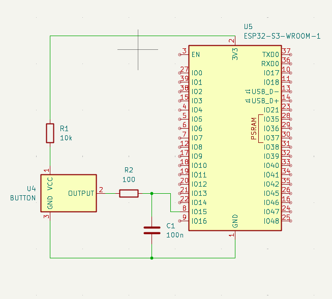
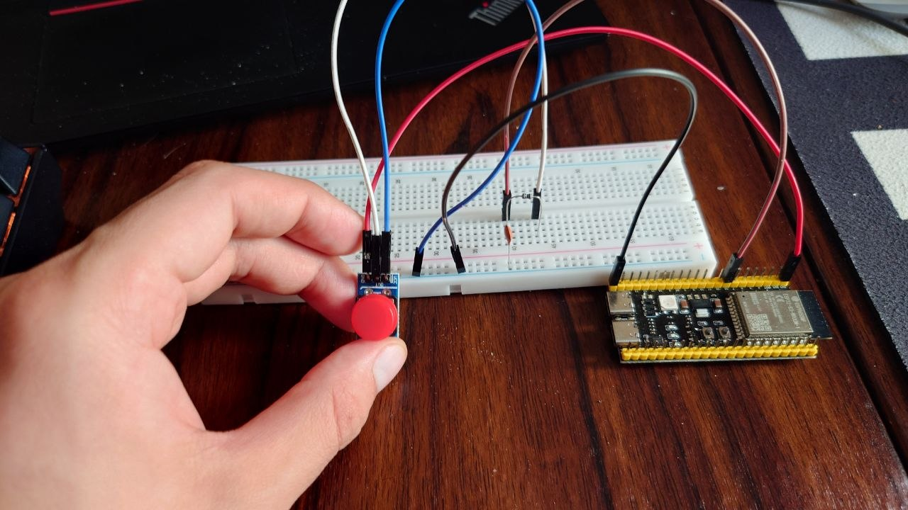

# Модуль 2.4. Анищенко М.О.

## Хід роботи

Цього разу усі завдання робив в одному проекті. 
Логіка кожного окремого підхіду до дебаунсу описана в окремому файлі `[назва методу]_debounce.c` та декларується в `[назва методу]_debounce.h`. \
`main.c` імпортує відповідний файл залоговків і використовує функцію `[назва методу]_debounce_app()` для запуску відповідної логіки

### Завдання 1: Базова реалізація (без debounce)
[no_debounce.c](debouncing-methods/src/no_debounce.c)
``` c
static volatile int counter = 0;

static void button_press_handler(void *args) {
    counter++;
}

static void init(const uint32_t button_pin) {
    gpio_config_t button_conf = {
        .mode = GPIO_MODE_INPUT,
        .intr_type = GPIO_INTR_NEGEDGE,
        .pin_bit_mask = (1 << button_pin)
    };

    ESP_ERROR_CHECK(gpio_config(&button_conf));

    ESP_ERROR_CHECK(gpio_install_isr_service(0));

    ESP_ERROR_CHECK(gpio_isr_handler_add(button_pin, button_press_handler, NULL));
}

void no_debounce_app(const int button_pin) {
    init(button_pin);

    int prev_counter = 0;
    while(1) {
        if (prev_counter < counter) {
            ESP_LOGI("no-debounce", "Counter: %d", ++prev_counter);
        }

        //to free up some time for scheduler, othervise i get watchdog errors
        vTaskDelay(1);
    }
}
```

### Завдання 2: Software debounce через таймер (time-based)
[time_based_debounce.c](debouncing-methods/src/time_based_debounce.c)
``` c
static volatile int counter = 0;
static volatile uint64_t last_registered = 0;

static void button_press_handler(void *args) {
    uint64_t now = esp_timer_get_time();
    if (now - last_registered >= 50000) {
        counter++;
        last_registered = now;
    }
}

static void init(const uint32_t button_pin) {
    gpio_config_t button_conf = {
        .mode = GPIO_MODE_INPUT,
        .intr_type = GPIO_INTR_NEGEDGE,
        .pin_bit_mask = (1 << button_pin)
    };

    ESP_ERROR_CHECK(gpio_config(&button_conf));

    ESP_ERROR_CHECK(gpio_install_isr_service(0));

    ESP_ERROR_CHECK(gpio_isr_handler_add(button_pin, button_press_handler, NULL));
}

void time_based_debounce_app(const int button_pin) {
    init(button_pin);

    int prev_counter = 0;
    while(1) {
        if (prev_counter < counter) { 
            ESP_LOGI("time-based-debounce", "Counter: %d", ++prev_counter);
        }
        
        //to free up some time for scheduler, othervise i get watchdog errors
        vTaskDelay(1);
    }
}
```

### Завдання 3: Debounce через перевірку рівня (state-based)
[state_based_debounce.c](debouncing-methods/src/state_based_debounce.c)
``` c
static volatile int counter = 0;
static TaskHandle_t counter_task_handle;
static int button_pin;


static void button_press_handler(void *args) {
    BaseType_t xHigherPriorityTaskWoken = pdFALSE;
    vTaskNotifyGiveFromISR(counter_task_handle, &xHigherPriorityTaskWoken);

    if (xHigherPriorityTaskWoken) {
        portYIELD_FROM_ISR();
    }
}

static void counter_task(void *args) {
    while (1) {
        ulTaskNotifyTake(pdTRUE, portMAX_DELAY);
        vTaskDelay(pdMS_TO_TICKS(20));

        if (gpio_get_level(button_pin) == 0) {
            ESP_LOGI("state-based-debounce", "Counter: %d", ++counter);
        }
    }
} 

void init() {
    gpio_config_t button_conf = {
        .mode = GPIO_MODE_INPUT,
        .intr_type = GPIO_INTR_NEGEDGE,
        .pin_bit_mask = (1 << button_pin)
    };

    ESP_ERROR_CHECK(gpio_config(&button_conf));

    ESP_ERROR_CHECK(gpio_install_isr_service(0));

    ESP_ERROR_CHECK(gpio_isr_handler_add(button_pin, button_press_handler, NULL));

    xTaskCreatePinnedToCore(
        counter_task,
        "counter",
        2048,
        NULL,
        5,
        &counter_task_handle,
        1
    );
}

void state_based_debounce_app(const int b_pin) {
    button_pin = b_pin;
    init();
}
```

### Завдання 4: Polling + debounce (без interrupts)
[pooling_debounce.c](debouncing-methods/src/pooling_debounce.c)
``` c
typedef enum {
    LOW,
    HIGH
} pin_state;

static void init(const uint32_t button_pin) {
    gpio_config_t button_conf = {
        .mode = GPIO_MODE_INPUT,
        .pin_bit_mask = (1 << button_pin)
    };
    gpio_config(&button_conf);
}

void pooling_debounce_app(const int button_pin) {
    init(button_pin);

    int counter = 0;
    pin_state current_state = HIGH;
    while(1) {
        vTaskDelay(pdMS_TO_TICKS(10));

        uint32_t new_state = gpio_get_level(button_pin);

        //react only if state changes
        if (new_state != current_state) {
            // counter is incresed only when signal goes from HIGH state to LOW
            // other cases are ignored
            if (current_state == HIGH && new_state == LOW) {
                ESP_LOGI("no-debounce", "Counter: %d", ++counter);
            }
            current_state = new_state;
        }
    }
}
```

### Завдання 5: Hardware debounce




### Завдання 6: Порівняльна таблиця

| Метод                                                | К-ть хибних спрацювань                                                     | Затримка                                          | Складність      | Коментар                                                                                                                          |
| ---------------------------------------------------- | -------------------------------------------------------------------------- | ------------------------------------------------- | --------------- | --------------------------------------------------------------------------------------------------------------------------------- |
| Без debounce                                         | 6 хибних срацювань на 15 натискань                                         | Відсутня                                          | Відсутня        | Непрактично через непередбачуваність                                                                                              |
| Time-based                                           | 4 хибних срацювання на 15 натискань, 3 з них при відпусканні               | Відсутня, але можливий пропус натискань           | Низька          | Майже повністю усуває хибні спрацювання при натискані, але пропускає їх при відпусканні                                           |
| State-based                                          | 7 хибних срацювання на 15 натискань, 4 з них при відпусканні               | Відсутня                                          | Середня         | Без додаткової затримки перед перевіркою рівня сигналу працює майже так само як і без debounce, бо час між операціями надто малий |
| State-based з додатковою затримкою перед зчитуванням | без хибних спрацювань                                                      | 20мс                                              | Вище середньої  | Відфільтровує усі хибні спрацювання, але додає помітний оверхед через додаткову таску                                             |
| Polling                                              | без хибних спрацювань                                                      | <= 10мс                                           | Середня         | Відфільтровує усі хибні спрацювання, але при використані у великому проекті може бути незручним в реалізації                      |
| Hardware RC + Без debounce                           | 4 хибних спрацювання на кожне натискання, одне з них завжди на відпусканні | невелика затримка на розрядку конденсатора        | Середня         | Через відсутність у ESP32 триггеру Шмітта, плавна розрядка\зарядка конденсатора викликає серію хибних спрацювань                  |
| Hardware RC + Time-based                             | 1 хибне спрацювання при відпусканні                                        | невелика затримка на розрядку конденсатора        | Середня         | Аналогічно Hardware RC + Без debounce, але спрацювання при натискані відфільтровуються затримкою                                  |
| Hardware RC + State-based з затримкою                | без хибних спрацювань                                                      | невелика затримка на розрядку конденсатора + 20мс | СВище середньої | Аналогічно Hardware RC + Без debounce, але всі хибні спрацювання відфільтровуються затримкою та перевіркою стану                  |
| Hardware RC + Polling                                | без хибних спрацювань                                                      | невелика затримка на розрядку конденсатора        | Середня         | Аналогічно Hardware RC + Без debounce, але всі хибні спрацювання відфільтровуються завдяки періодичності опитування               |