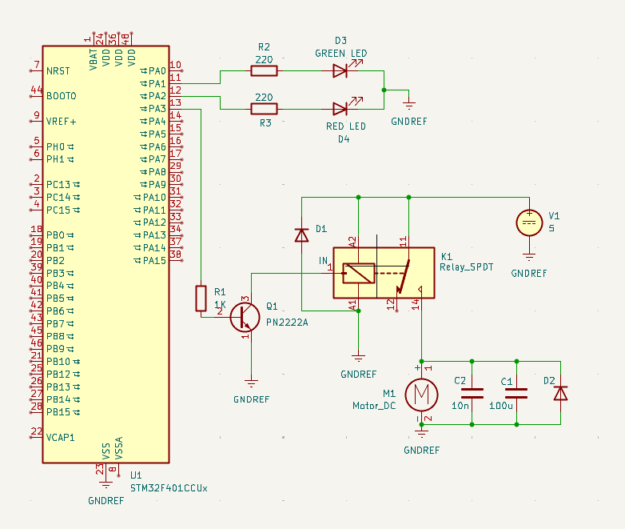

# Модуль 2.5. Керування витяжним вентилятором через STM32 timer + relay

ВІДЕО РОБОТИ: [https://youtu.be/raGZeckykUI?si=LoZQcDcsKEZZ5BwZ](https://youtu.be/raGZeckykUI?si=LoZQcDcsKEZZ5BwZ)
ПРОЕКТ: [stm32-timer-relay-control](stm32-timer-relay-control/)

## Короткий опис проєкту

У цьому модулі реалізовано керування двигуном через реле. Таймер автоматично вмикає навантаження на заданий проміжок часу, після чого вимикає його і повторює цикл не використовуючи `while(1)`.

Поточна реалізація побудована навколо апаратного таймера `TIM2`:

- таймер формує повний цикл `увімкнено + вимкнено`;
- подія `output compare` перемикає реле в протилежний стан всередині циклу;
- подія `period elapsed` повертає систему у початковий стан на старті нового циклу;
- головний цикл після ініціалізації залишається порожнім.

Для налагодження в коді сконфігуровано скорочені інтервали:

- `activity_time_s = 3`
- `inactivity_time_s = 12`

## Структура проєкту

```text
stm32-timer-relay-control/
├── Core/
│   ├── Inc/
│   │   ├── logger.h
│   │   ├── main.h
│   │   └── relay_control.h
│   └── Src/
│       ├── logger.c
│       ├── main.c
│       ├── relay_control.c
│       └── stm32f4xx_hal_msp.c
├── CustomDrivers/
│   ├── Inc/
│   │   ├── stm32f4xx_hal_tim.h
│   │   └── stm32f4xx_hal_tim_ex.h
│   └── Src/
│       ├── stm32f4xx_hal_tim.c
│       └── stm32f4xx_hal_tim_ex.c
```

### Призначення основних файлів

- `stm32-timer-relay-control/Core/Src/main.c` - ініціалізація GPIO, UART і запуск модуля керування реле з потрібними часовими параметрами.
- `stm32-timer-relay-control/Core/Src/relay_control.c` - логіка налаштування `TIM2`, обробка timer callbacks і перемикання стану реле та індикаторів.
- `stm32-timer-relay-control/Core/Inc/relay_control.h` - конфігураційна структура `relay_config_t` з пінами і тривалостями.
- `stm32-timer-relay-control/Core/Src/logger.c` - UART-логер для відлагодження поточного стану системи.
- `stm32-timer-relay-control/Core/Src/CustomDrivers` - драйвер таймера імпортований вручну, щоб мати модживість сконфігурувати його в коді, а не через MX


## Схема підключення

Для керування використовується `STM32F401CCU6`. Вихід реле і два індикаторні світлодіоди підключені до порту `GPIOA`.



### Використані піни

- `PA3` - керування реле
- `PA1` - LED індикації стану `ON`
- `PA2` - LED індикації стану `OFF`
- `PA9` - `USART1_TX`
- `PA10` - `USART1_RX`

## Процес ініціалізації

### 1. Ініціалізація периферії в `main`

`main.c` лише піднімає базову периферію і передає параметри в модуль керування реле. Після цього виконання не містить жодної прикладної логіки в циклі `while(1)`.

```c
logger_init(&huart1);
relay_config_t relay_config = {
  .port = GPIOA,
  .relay_pin = GPIO_PIN_3,
  .on_led_pin = GPIO_PIN_1,
  .off_led_pin = GPIO_PIN_2,
  .start_active = 1,
  .activity_time_s = 3,
  .inactivity_time_s = 12
};
relay_control_init(relay_config);
```

Саме це і забезпечує незалежність таймерів від коду в основному циклі.

### 2. Передача конфігурації в модуль керування

Структура `relay_config_t` містить:

- GPIO-порт;
- пін реле;
- пін індикатора `ON`;
- пін індикатора `OFF`;
- початковий стан `start_active`;
- тривалість активної фази;
- тривалість неактивної фази.

```c
typedef struct {
    GPIO_TypeDef* port;
    uint16_t relay_pin;
    uint16_t on_led_pin;
    uint16_t off_led_pin;

    uint16_t inactivity_time_s;
    uint16_t activity_time_s;
    uint16_t start_active;
} relay_config_t;
```

Такий підхід дозволяє змінювати інтервали і піни без переписування timer-логіки.

## Алгоритм роботи таймера

### 1. Формування повного циклу

У `relay_control_init(...)` таймер `TIM2` налаштовується так, щоб один його повний період дорівнював сумі часу активності та простою.

```c
uint16_t full_on_off_period = relay_config.activity_time_s + relay_config.inactivity_time_s;

htim2 = (TIM_HandleTypeDef){
    .Instance = TIM2,
    .Init.Prescaler = 15999,
    .Init.CounterMode = TIM_COUNTERMODE_UP,
    .Init.Period = full_on_off_period * 1000 - 1,
    .Init.ClockDivision = TIM_CLOCKDIVISION_DIV1,
    htim2.Init.AutoReloadPreload = TIM_AUTORELOAD_PRELOAD_DISABLE
};
```

Оскільки APB1 тут налаштовано на `16 MHz`, прескалер `15999` дає 1 крок таймера на 1 мс. Далі `Period` задається в мілісекундах для всього циклу.

### 2. Перемикання стану всередині циклу

Щоб не чекати завершення повного періоду, використовується `output compare` на каналі `TIM_CHANNEL_4`. Значення `Pulse` визначає момент, коли стан має змінитися вперше.

```c
uint16_t state_switch_cnt = relay_config.start_active ? relay_config.activity_time_s : relay_config.inactivity_time_s;

TIM_OC_InitTypeDef clock_oc_config = {
    .OCMode = TIM_OCMODE_TIMING,
    .Pulse = state_switch_cnt * 1000 - 1 ,
    .OCPolarity = TIM_OCPOLARITY_HIGH,
    .OCFastMode = TIM_OCFAST_DISABLE
};

HAL_TIM_OC_ConfigChannel(&htim2, &clock_oc_config, TIM_CHANNEL_4);
```

Якщо система стартує в активному стані, то `Pulse` дорівнює тривалості активної фази. Якщо стартовий стан був би неактивним, перемикання відбулось би через час простою.

### 3. Запуск переривань таймера

Після конфігурації вмикаються обидва режими:

- `HAL_TIM_Base_Start_IT(...)` для події завершення повного періоду;
- `HAL_TIM_OC_Start_IT(...)` для проміжного перемикання по `output compare`.

```c
status = HAL_TIM_Base_Start_IT(&htim2);
log_to_serial("Base start: %d\r\n", status);
status = HAL_TIM_OC_Start_IT(&htim2, TIM_CHANNEL_4);
log_to_serial("OC start: %d\r\n", status);
```

Після цього таймер працює автономно.

## Обробка подій таймера

### 1. Подія `output compare`

Коли лічильник доходить до точки `Pulse`, викликається `HAL_TIM_OC_DelayElapsedCallback(...)`. У цій події стан реле переводиться у протилежний до `start_active`.

```c
void HAL_TIM_OC_DelayElapsedCallback(TIM_HandleTypeDef *htim) {
    if (htim->Instance == TIM2) {
        set_state(!relay_config.start_active);
    }
}
```

У поточному налаштуванні це означає: після 3 секунд активності реле вимикається.

### 2. Подія завершення повного періоду

Коли завершується весь цикл, `HAL_TIM_PeriodElapsedCallback(...)` повертає систему у початковий стан.

```c
void HAL_TIM_PeriodElapsedCallback(TIM_HandleTypeDef *htim) {
    if (htim->Instance == TIM2) {
        set_state(relay_config.start_active);
    }
}
```

Для поточної конфігурації це означає: через 12 секунд простою починається новий цикл, і реле знову вмикається.

### 3. Оновлення реле, LED і логів

Вся фактична зміна стану зібрана в одній функції `set_state(...)`.

```c
static void set_state(GPIO_PinState new_state) {
    HAL_GPIO_WritePin(relay_config.port, relay_config.relay_pin, new_state);

    HAL_GPIO_WritePin(relay_config.port, relay_config.on_led_pin, new_state);
    HAL_GPIO_WritePin(relay_config.port, relay_config.off_led_pin, !new_state);

    log_to_serial("Relay is now %s\r\n", new_state ? "OPEN" : "CLOSED");
}
```

Тут реалізовано одразу три речі:

- перемикання реле;
- дублювання стану на двох LED;
- логування нового стану через `USART1`.

## UART-логування

Для відлагодження використано простий serial-логер, який працює через `USART1` на швидкості `115200`.

```c
void log_to_serial(const char * msg, ...) {
    static char outputBuffer[OUTPUT_BUFF_SIZE] = {0};

    va_list args;
    va_start(args, msg);
    vsnprintf(outputBuffer, (size_t)OUTPUT_BUFF_SIZE, msg, args);
    va_end(args);

    HAL_UART_Transmit(huart, (uint8_t *)outputBuffer, (uint16_t)strlen(outputBuffer), HAL_MAX_DELAY);
}
```

Логер виводить:

- статус ініціалізації таймера;
- статус конфігурації `clock source` та `output compare`;
- повідомлення про кожне перемикання реле.