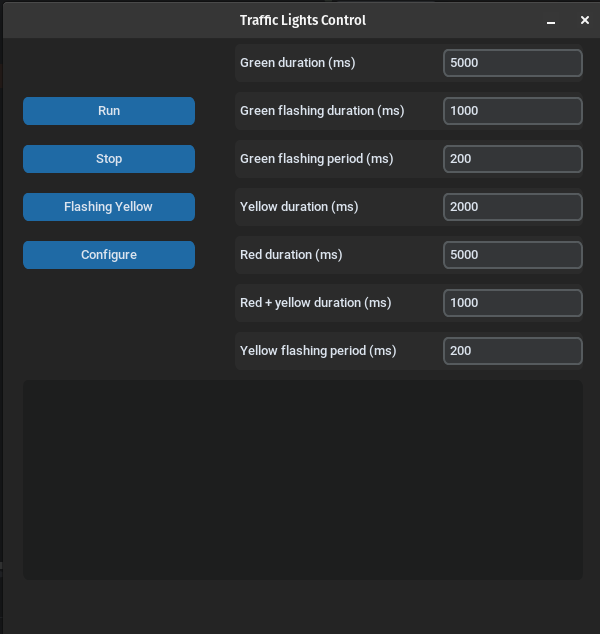
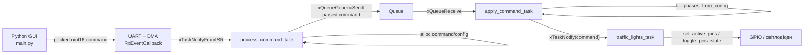

# Проєкт "Світлофор": STM32 + FreeRTOS + UART + Python GUI

ВІДЕО РОБОТИ: [https://youtube.com/shorts/2TTs6l9UEJQ?si=XaHqgusTIA8MFGAS](https://youtube.com/shorts/2TTs6l9UEJQ?si=XaHqgusTIA8MFGAS)

## Короткий опис проєкту

Цей проєкт складається з двох пов'язаних частин:

- [traffic-lights-with-freertos-and-uart-config](traffic-lights-with-freertos-and-uart-config) - прошивка, яка реалізує логіку світлофора, приймає команди через UART і керує світлодіодами.
- [traffic-lights-companion-app](traffic-lights-companion-app) - Python-застосунок з GUI, через який можна запускати, зупиняти, переводити світлофор у режим миготливого жовтого та змінювати часові параметри фаз.

На прикладному рівні система працює так: GUI формує бінарну команду, надсилає її через serial, прошивка приймає її, перетворює у внутрішню структуру і передає в задачу, що керує режимом роботи світлофора.

Проєкт побудований як проста подієва система з розділенням відповідальностей:

- Python GUI відповідає за введення параметрів і відправлення команд.
- Модуль прийому команд відповідає за UART-протокол і перетворення байтів у внутрішні структури.
- Модуль світлофора відповідає за стан автомата і фізичну логіку перемикання фаз.
- FreeRTOS забезпечує ізоляцію цих етапів через задачі, чергу, notification і системний tick.


## Структура проєкту

```text
traffic-lights-companion-app/
└── main.py
traffic-lights-with-freertos-and-uart-config/
├── Core/Inc/
│   ├── command_handling.h
│   ├── commands.h
│   ├── logger.h
│   └── traffic-lights.h
└── Core/Src/
    ├── main.c
    └── app/
        ├── command_handling.c
        ├── commands.c
        ├── logger.c
        └── traffic-lights.c
```

### Призначення основних файлів

- `traffic-lights-companion-app/main.py` - GUI, кнопки керування, поля конфігурації, пакування команди в бінарний формат і надсилання через serial.
- `Core/Src/app/commands.c` - створення і звільнення структур `command_t` та `traffic_config_t`.
- `Core/Src/app/command_handling.c` - прийом байтів з UART, перетворення буфера в команду і передача її далі через чергу.
- `Core/Src/app/traffic-lights.c` - станова логіка світлофора, обробка режимів і перемикання фаз.
- `Core/Src/app/logger.c` - передача текстових логів по UART.
- `Core/Src/main.c` - точка ініціалізації прикладних модулів: логер, черга команд, модуль світлофора та обробник команд.

## Процес обробки команд

### 1. Формування команди в Python GUI

У застосунку визначено 4 команди:

- `Run` (`1`)
- `Stop` (`2`)
- `Flashing Yellow` (`3`)
- `Configure` (`4`)

Для `Run`, `Stop` і `Flashing Yellow` передається лише код команди. Для `Configure` разом з кодом команди передаються 7 параметрів конфігурації:

- `green_ms`
- `green_flashing_ms`
- `green_flashing_period`
- `yellow_ms`
- `red_ms`
- `red_and_yellow_ms`
- `flashing_yellow_period`

Перед відправленням масив чисел пакується через `struct.pack(... "H")`, тобто як послідовність 16-бітних беззнакових значень у little-endian форматі.

Файл `traffic-lights-companion-app/main.py`:

```python
def send_command(self, full_command):
    command_b = struct.pack("<" + str(len(full_command)) + "H", *full_command)
    app.append_text("APP: Packed command: " + " ".join(f"{b:02X}" for b in command_b)  + "\n")
    self.ser.write(command_b)
```

**Інтерфейс** \


### 2. Приймання команди в прошивці

Прошивка приймає дані через UART з DMA. Коли прийом завершується по події `idle`, колбек:

- копіює отримані байти з DMA-буфера у локальний буфер команд;
- повторно запускає DMA-прийом;
- будить задачу `process_command_task` через task notification.

Таким чином ISR не виконує повний розбір команди, а лише фіксує факт надходження даних і передає обробку в контекст задачі.

Файл `traffic-lights-with-freertos-and-uart-config/Core/Src/app/command_handling.c`:

```c
void HAL_UARTEx_RxEventCallback(UART_HandleTypeDef *huart, uint16_t Size)
{
    if (huart->Instance == USART1) {
        memcpy(command_buff, dma_buff, Size);
        memset(dma_buff, 0, Size);

        HAL_UARTEx_ReceiveToIdle_DMA(huart, dma_buff, sizeof(dma_buff));
        __HAL_DMA_DISABLE_IT(huart->hdmarx, DMA_IT_HT);

        BaseType_t pxHigherPriorityTaskWoken = pdFALSE;
        xTaskNotifyFromISR(process_command_task_h, 0, eNoAction, &pxHigherPriorityTaskWoken);
        portYIELD_FROM_ISR(pxHigherPriorityTaskWoken);
    }
}
```

### 3. Парсинг команди

Задача `process_command_task`:

- очікує на notification;
- читає перше 16-бітне значення як тип команди;
- для простих команд створює `command_t` без конфігурації;
- для `COMMAND_CONFIG` додатково створює `traffic_config_t` і заповнює її значеннями з буфера;
- відправляє вказівник на `command_t` у чергу команд.

Файл `traffic-lights-with-freertos-and-uart-config/Core/Src/app/command_handling.c`:

```c
static void process_command_task(void *params) {
    while(1) {
        ulTaskNotifyTake(pdTRUE, portMAX_DELAY);

        uint16_t command_bit = command_buff[0];
        command_t *command = NULL;

        switch (command_bit) {
            case COMMAND_RUN:
            case COMMAND_STOP:
            case COMMAND_FLASHING_YELLOW:
                command = alloc_and_create_command((command_types)command_bit, NULL);
                break;
            case COMMAND_CONFIG:
                command = alloc_and_create_command(
                    (command_types)command_bit,
                    create_config_from_buffer(&command_buff[1])
                );
                break;
        }

        send_command(command);
    }
}
```

### 4. Передача команди в модуль світлофора

Задача `apply_command_task` читає команди з черги:

- надсилає код команди у `traffic_lights_task` через `xTaskNotify(..., eSetValueWithOverwrite)`;
- якщо отримано `COMMAND_CONFIG`, оновлює масив фаз через `fill_phases_from_config(...)`;
- після цього звільняє пам'ять, виділену під команду та конфігурацію.

Файл `traffic-lights-with-freertos-and-uart-config/Core/Src/app/traffic-lights.c`:

```c
void apply_command_task(void *params) {
    command_t *command;
    while(1) {
        xQueueReceive(command_queue_h, &command, portMAX_DELAY);
        xTaskNotify(traffic_lights_task_h, command->command, eSetValueWithOverwrite);
        if (command->command == COMMAND_CONFIG) {
            fill_phases_from_config(command->config);
        }

        free_command(command);
    }
}
```

## Алгоритм роботи світлофора

### Режими роботи

У логіці світлофора реалізовано 3 основні режими:

- `COMMAND_RUN` - звичайний цикл світлофора;
- `COMMAND_STOP` - зупинка автоматичного циклу;
- `COMMAND_FLASHING_YELLOW` - нескінченне миготіння жовтого.

Команда `COMMAND_CONFIG` не перемикає режим сама по собі, а лише змінює часові параметри фаз, які будуть використані далі.

Файл `traffic-lights-with-freertos-and-uart-config/Core/Src/app/traffic-lights.c`:

```c
if (notification == COMMAND_RUN) {
    reset_traffic_lights_task_state(regular_mode_phases, sizeof(regular_mode_phases)/sizeof(phase_t));
} else if (notification == COMMAND_FLASHING_YELLOW) {
    reset_traffic_lights_task_state(&flasing_yellow_phase, 1);
} else if (notification == COMMAND_STOP) {
    log_to_serial("Stopped \r\n");
} else if (notification == COMMAND_CONFIG) {
    log_to_serial("Configuration \r\n");
}
```

### Фази звичайного циклу

Під час `Run` використовується масив із 5 фаз:

1. зелений;
2. зелений миготливий;
3. жовтий;
4. червоний;
5. червоний + жовтий.

Кожна фаза описується структурою:

- `pin_bit_mask` - які лампи мають бути активними;
- `duration_ticks` - тривалість фази;
- `period_ticks` - період миготіння, якщо фаза має блимати.

Файл `traffic-lights-with-freertos-and-uart-config/Core/Src/app/traffic-lights.c`:

```c
typedef struct {
    uint16_t pin_bit_mask;
    uint16_t duration_ticks;
    uint16_t period_ticks;
} phase_t;

static void fill_phases_from_config(traffic_config_t *config) {
    regular_mode_phases[0] = (phase_t){
        .pin_bit_mask = 1 << pin_config.green_light_pin,
        .duration_ticks = config->green_ms,
        .period_ticks = 0
    };

    regular_mode_phases[1] = (phase_t){
        .pin_bit_mask = 1 << pin_config.green_light_pin,
        .duration_ticks = config->green_flashing_ms,
        .period_ticks = pdMS_TO_TICKS(config->green_flashing_period)
    };

    regular_mode_phases[2] = (phase_t){
        .pin_bit_mask = 1 << pin_config.yellow_light_pin,
        .duration_ticks = config->yellow_ms,
        .period_ticks = 0
    };
}
```

### Перемикання фаз

Задача `traffic_lights_task` працює циклічно:

- перевіряє, чи надійшла нова команда;
- залежно від команди або скидає стан автомата, або залишає систему в поточному пасивному режимі;
- для режиму `Run` контролює завершення поточної фази за tick-лічильником;
- після завершення фази переходить до наступної по колу;
- якщо для фази задано `period_ticks`, виконує перемикання стану виходів через `toggle_pins_state(...)`.

Початок нового режиму викликає `reset_traffic_lights_task_state(...)`, яка:

- прив'язує потрібний набір фаз;
- скидає індекс поточної фази;
- запам'ятовує час старту;
- одразу виставляє виходи під першу фазу.

Файл `traffic-lights-with-freertos-and-uart-config/Core/Src/app/traffic-lights.c`:

```c
static void reset_traffic_lights_task_state(phase_t* phases, size_t number_of_phases) {
    cts.phases = phases;
    cts.number_of_phases = number_of_phases;
    cts.phase_started = xTaskGetTickCount();
    cts.phase_idx = 0;
    cts.phase = regular_mode_phases[cts.phase_idx];
    cts.phase_duration = cts.phase.duration_ticks;
    cts.number_of_blinks = 0;
    cts.blinking_period = cts.phase.period_ticks;
    set_active_pins(cts.phase.pin_bit_mask);
    cts.last_command = COMMAND_NONE;
}
```

```c
if (cts.last_command == COMMAND_RUN) {
    TickType_t now = xTaskGetTickCount();
    if (now - cts.phase_started >= cts.phase.duration_ticks) {
        cts.phase_idx = (cts.phase_idx + 1) % cts.number_of_phases;
        cts.phase = regular_mode_phases[cts.phase_idx];
        cts.phase_started = xTaskGetTickCount();
        cts.blinking_period = cts.phase.period_ticks;
        cts.number_of_blinks = 0;
        set_active_pins(cts.phase.pin_bit_mask);
    } else if (cts.blinking_period != 0 &&
               (now - cts.phase_started) / cts.blinking_period > cts.number_of_blinks) {
        toggle_pins_state(cts.phase.pin_bit_mask);
        cts.number_of_blinks++;
    }
}
```

### Миготливий жовтий

Для режиму `COMMAND_FLASHING_YELLOW` використовується окрема фаза:

- активний лише жовтий сигнал;
- тривалість умовно нескінченна (`UINT16_MAX`);
- світло перемикається з періодом `flashing_yellow_period`.

Файл `traffic-lights-with-freertos-and-uart-config/Core/Src/app/traffic-lights.c`:

```c
if (cts.last_command == COMMAND_FLASHING_YELLOW) {
    TickType_t now = xTaskGetTickCount();
    if (cts.blinking_period != 0 &&
        (now - cts.phase_started) / cts.blinking_period > cts.number_of_blinks)  {
        toggle_pins_state(cts.phase.pin_bit_mask);
        cts.number_of_blinks++;
    }
}
```

### Зупинка

У режимі `COMMAND_STOP` задача світлофора не виконує нових переходів між фазами і чекає на наступну команду зміни стану.

Файл `traffic-lights-with-freertos-and-uart-config/Core/Src/app/commands.c`:

```c
} else if (notification == COMMAND_STOP) {
    log_to_serial("Stopped \r\n");
}
```

## Задіяні елементи FreeRTOS

У прикладній логіці цього проєкту використовуються такі механізми FreeRTOS:

- `xTaskCreate(...)` - створення задач `process_command_task`, `apply_command_task` і `traffic_lights_task`.
- `vTaskStartScheduler()` - запуск планувальника.
- `xQueueGenericCreate(...)` - створення черги команд між модулями.
- `xQueueGenericSend(...)` / `xQueueReceive(...)` - передача команд між задачами.
- `xTaskNotifyFromISR(...)` - пробудження задачі парсингу з UART callback.
- `ulTaskNotifyTake(...)` - очікування notification у задачах.
- `xTaskNotify(..., eSetValueWithOverwrite)` - передача коду останньої команди у задачу світлофора.
- `vTaskDelay(10)` - коротка пауза в циклі задачі світлофора.
- `xTaskGetTickCount()` - вимірювання часу життя поточної фази.
- `pvPortMalloc(...)` / `vPortFree(...)` - виділення та звільнення пам'яті під структури команд і конфігурації.

Файл `traffic-lights-with-freertos-and-uart-config/Core/Src/app/traffic-lights.c`:

```c
*command_queue_p = xQueueGenericCreate(5, sizeof(command_t*), queueQUEUE_TYPE_BASE);
command_queue_h = *command_queue_p;

xTaskCreate(apply_command_task, "apply_command_task", 256, NULL, 15, &apply_command_task_h);
xTaskCreate(traffic_lights_task, "traffic_lights_task", 512, NULL, 10, &traffic_lights_task_h);
xTaskCreate(process_command_task, "process_command_task", 512, NULL, 20, &process_command_task_h);
```

### Mermaid-діаграма взаємодії задач



### Керування пам'яттю команд

Для передачі команд між задачами використовуються динамічно виділені структури `command_t` і `traffic_config_t`.

Файл `traffic-lights-with-freertos-and-uart-config/Core/Src/app/commands.c`:

```c
command_t* alloc_and_create_command(command_types command, traffic_config_t *config) {
    command_t* new_command = pvPortMalloc(sizeof(command_t));
    new_command->command = command;
    new_command->config = config;
    return new_command;
}

traffic_config_t* alloc_and_create_config() {
    return pvPortMalloc(sizeof(traffic_config_t));
}

void free_command(command_t* command) {
    if (command == NULL) {
        return;
    }

    if (command->config != NULL) {
        vPortFree(command->config);
    }
    vPortFree(command);
}
```